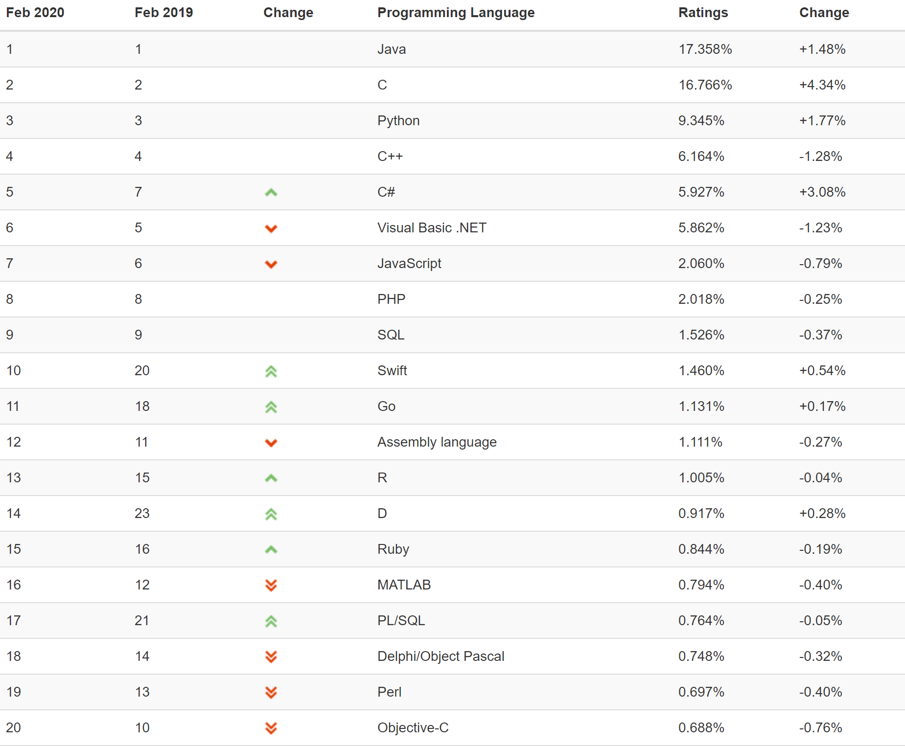
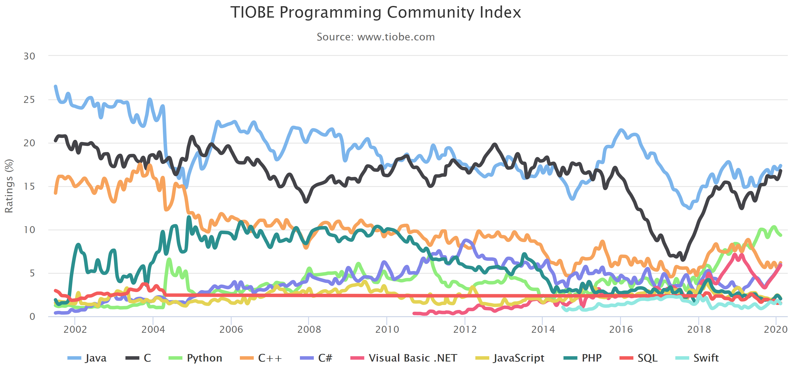
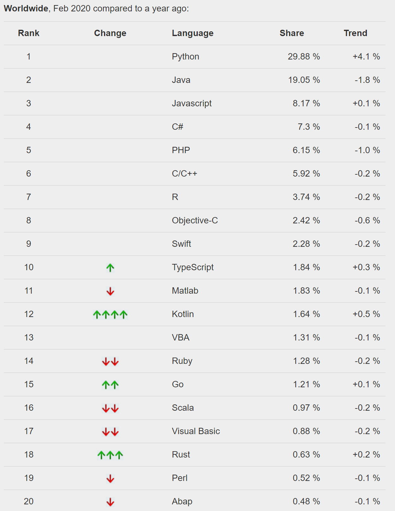

# 01.C语言概述

[01.1 计算机与编程语言](011-计算机与编程语言)

[01.2 C语言](#012-c语言)

[01.3]()

[01.4]()

## 01.1 计算机与编程语言

日常生活中，计算机无处不在。比如：ATM、点钞机、手机等等……

通常来说，我们习惯于使用已经存在的软件。例如手机上我们经常下载安装已经有的APP例如微信、淘宝等。但有时候，我们找不到符合我们要求的软件，或者想要⾃⼰设计⼀些功能和⾏为，让计算机按照你的意图做事情，就需要写程序了。

总的来说，写软件，尤其是完全从零开始的程序设计已经较为稀有。

这门课学习C语言程序设计，重点并不是在于让同学们用C语言写一个软件，而是让同学们通过学习知道计算机背后的工作原理，以及程序设计的标准和精神。计算机的长处和短处、程序（不只是C语言程序）应该如何设计、怎么和业界标准（不仅限于C语言）结合，这些才是同学们真正需要掌握的。

### 计算机如何解决问题

涉及到计算机的组成结构：中央处理单元（CPU）、随机存取内存（RAM）、永久内存存储设备（ROM）。

计算机主要由CPU处理程序，而CPU只能理解有限的指令，而且有如下两个限制：

1. 储存在计算机中的所有内容都是数字。
2. 计算机程序最终必须以数字指令码（机器语言）来表示。

因此，要让计算机进行工作，必须为其提供特殊的指令序列（即程序），确切地告诉计算机要做的事以及如何做。而且必须使用计算机能直接明白的语言（机器语言）创建程序。

### 计算机的语言

程序是⽤特殊的编程语⾔写出来表达如何解决问题的。不是⽤编程语⾔来和计算机交谈，⽽是描述要求它如何做事情的过程或⽅法。

下面是一个例子，他们是一个程序，一个是用机器语言展示，另一个是用C语言展示。

机器语言（十六进制）

```assembly
dl_relocate_static_pie:
 repz retq 
 nopw   %cs:0x0(%rax,%rax,1)
 nopl   0x0(%rax)
main:
 push   %rbp
 mov    %rsp,%rbp
 movl   $0x5,-0x4(%rbp)
 movl   $0xa,-0x8(%rbp)
 mov    -0x4(%rbp),%eax
 mov    %eax,-0xc(%rbp)
 mov    -0x8(%rbp),%eax
 mov    %eax,-0x4(%rbp)
 mov    -0xc(%rbp),%eax
 mov    %eax,-0x8(%rbp)
 mov    $0x0,%eax
 pop    %rbp
 retq   
 nopl   (%rax)
```

对于大部分人（包括我）而言，上面这段程序晦涩难懂，犹如天书。而它其实是由下面一段代码产生出来的，是我们即将要学习的C语言。

```C
int main(void) {
    int var1 = 5, var2 = 10;
    int temp = var1;
    var1 = var2;
    var2 = temp;
    return 0;
}
```

这段代码是上面那段机器语言的本来面目，同学们现在可能还无法完全理解这段代码的含义，但是可以大概猜测出它的意思。

为了方便大家理解，我用中文解释一下，这段代码是交换了两个“东西”的数值，它有以下几个步骤。

1. 一开始有两个东西，第一个东西"var1"是5，第二个东西"var2"是10
2. 创建一个临时的东西"temp"，让它"等于"var1
3. 让var1"等于"var2
4. 让var2"等于"temp

现在看来，这段代码可以有三种说明方式（解释）：第一种说明方式是计算机才能明白的机器语言；第二种是程序员以及学习过C语言的人才能明白的语言（程序）；第三种我的说明才是大部分一般人能懂的逻辑概念（算法）。

为什么叫算法？因为计算机做的所有的事情都叫做计算。

我们要让计算机做计算,就需要像这样找出计算的步骤,然后⽤编程语⾔写出来。而这些计算的步骤就是算法。

### 计算机的思维

现在我们要解决如下的问题：

求解以下方程：
$$
2x+6=20
$$
根据我们人类思维方式，用解方程的方法，把未知量移到一边，把已知量移到另一边，很容易得到x=7。

而对计算机而言，它并不知道解方程的方法，但是我们可以想办法给它提供步骤，比如让计算机凑出合适的解。思路如下
$$
x=0,2x+6=6<20;\\
x=1,2x+6=8<20;\\
...\\
x=7,2x+6=20
$$
通过慢慢变化x的值，计算机可以试出我们想要的解。

这种方法叫做枚举或者穷举，列出所有可能的解，让计算机一个个尝试，然后挑选合适的解。

还有，假设我们已经知道解可能所处的范围，我们可以使用二分法（高中数学的牛顿逼近法）来解。比如说我们知道x在0-10之间，
$$
x=5,2x+6=16<20;\\
x=7,2x+6=20
$$
通过选取区间的中间值判断和目标的大小关系逐渐逼近，也可以得到我们想要的解。这种方法也叫做二分搜索。

现在，假如我们已经写好了这个程序，那么怎么让计算机能明白我们的程序呢？

计算机为了执行我们写的程序，有以下两种方案：

1. 解释：借助⼀个程序，那个程序能试图理解你的程序，然后按照你的要求执⾏。
2. 编译：借助⼀个程序，就像⼀个翻译，把你的程序翻译成计算机真正能懂的语⾔——机器语⾔——写的程序，然后，这个机器语⾔写的程序就能直接执⾏了。

注意，这只是计算机理解我们程序的方式，语言本身并没有解释或者编译的区别。比如C语言常用编译方法，但是也有人写出了解释型的C语言。而Python通常使用解释，但是也有人写出了编译型的Python语言。这些只是常用的执行方式而已。一般而言，解释型语⾔有特殊的计算能⼒，而编译型语⾔有确定的运算性能。除了传统和喜好外，二者已无主要差别。

至于解释和编译的具体差别，可以查看

[解释型语言]([https://baike.baidu.com/item/%E8%A7%A3%E9%87%8A%E5%9E%8B%E8%AF%AD%E8%A8%80/8888952](https://baike.baidu.com/item/解释型语言/8888952))

[编译型语言]([https://baike.baidu.com/item/%E7%BC%96%E8%AF%91%E5%9E%8B%E8%AF%AD%E8%A8%80](https://baike.baidu.com/item/编译型语言))

## 01.2 C语言

### Why C

从计算机发明到现在，已经涌现出了许多编程语言。而根据[TIOBE指数](https://www.tiobe.com/tiobe-index/)，还有[PYPL](http://pypl.github.io/PYPL.html)，二者都是编程语言流行度的参考，我们可以了解到尽管C语言拥有古老的历史（1972年由贝尔实验室的Dennis Ritch & Ken Thompson发明），C语言如今仍旧拥有非常高的流行度。

#### TIOBE排名表



#### TIOBE折线图



#### PYPL



而从上面的几方面资料我们知道C语言从2002年以来都处于稳定而且难以替代的位置。当然，这些都不能作为语言流行度的绝对参考依据，但是我依然想要告诉大家为什么C语言的受众如此之多。或者再直白，为什么我们使用C语言而不是其他更为简单便捷的语言作为入门编程语言呢？

1. 现代的编程语⾔在语法上的差异很⼩，其实大多数语言已经是C-like模式了。得益于C几乎淘汰了同时代的大多数编程语言，而现在大多数语言其实是派生（C++）或者借鉴（Golang）C语言。掌握了C语言，对于学习和掌握其他编程语言有十分重大的意义。

2. 一种编程语⾔的能⼒/适⽤领域主要是由

3. 1. 库
   2. 传统所决定的

下面是一段相同的代码，我们分别用C、Python、JavaScript和Java来表示一下

下面是C语言

```c
#include <stdio.h>

int main(void) {
    printf("Hello World\n");
    return 0;
}
```

下面是Python语言

```python
print("Hello World")
```

下面是JavaScript语言

```javascript
console.log("Hello World");
```

下面是Java语言

```java
public class Main {
	public static void main(String[] args) {
		System.out.println("Hello World");
	}
}
```

大家可以看到，虽然各种语言在语法上有略微差别，但是相差并不大。所以即使对于非计算机专业的学生来说，使用C语言入门其实并没有那么高的难度。

另外，C语言有以下优点让它难有匹敌：

1. 高效性-具有通常是汇编语言才具有的微调控制能力，在资源紧张的时候几乎是唯一选择
2. 可移植性-除了针对特殊硬件设备和操作系统以外，C语言的代码都是可以移植的。无论是Windows，Macintosh或者Linux平台，代码都不需要修改即可直接编译使用
3. 强大而灵活-许多编程语言（比如Python）的编译器和解释器都是用C语言编写的

当然，只讨论C语言的优点而对缺点避而不谈，似乎也是不恰当的。在后面的学习中，我希望同学们可以根据自己的学习情况谈谈C语言有哪些“用户不友好”的地方。

就我个人而言，在后面学习的指针是C的痛点之一，字符串的处理我认为也是比较繁琐的一个地方。因为我个人主要兴趣在全栈式开发，而当今用C语言进行全栈式Web开发也已经不是主流选择。这些既有历史的原因，也有C语言自身的局限性，但总的来说，如果“消灭”了这些缺点，其实本身也是“消灭”了C的优点乃至C语言本身。

因此假如后面同学们深陷C语言的“泥潭”之中，请大家记得这本身是C语言的特性或者说是它闪光点的背面。我也强烈推荐大家学习比如Python或者一些Web开发语言比如JavaScript或者IT工业界的主流Java（我会将学习资料放在课程资料中）。这样大家便可以因地制宜地进行选择，更好地理解编程语言，在日后的程序设计和开发中妥善选择适合的语言或者工具。

#### C语言的历史

1. C->B->BCPL->FORTRAN
2. BCPL和B都⽀持指针间接⽅式，所以C也⽀持了
3. C语⾔还受到了PL/1的影响，还和PDP-11的机器语⾔有很⼤的关系

#### C语言的版本

1. 经典C（K&R C）K&R即为本课使用教材的两位作者
2. 1989年ANSI发布了⼀个标准——ANSI C/C89
3. 1990年ISO接受了ANSI的标准——C90
4. C的标准在1995年和1999年两次更新——C95和C99
5. 所有的当代编译器都⽀持C99了，但并非所有编译器都完全实现C99的所有改动。因此本课虽然是基于C99标准的，对于有部分不被普遍支持的C99标准将会特别注明
6. 标准委员会2011年发布了C11标准，本课会介绍部分C11新特性，但不作为主要内容

#### C语言的用处

1. 操作系统
2. 嵌入式系统
3. 驱动程序
4. 底层驱动
   1. 图像引擎、图像处理、声音处理

因此，C语言的运行效率>>学习效率（开发效率），运行效率>>开发乐趣，日常应用很少直接使用C语言编写，我们学习C的过程主要是写练习代码而非真实软件。

C需要被编译才能运行，因此你需要

1. 编辑器+编译器或者
2. 集成开发环境（IDE）

#### 推荐的离线编程软件

对于大部分刚入门的同门<u>*不推荐*v</u>im/emacs，也*<u>不推荐</u>*eclipse。

##### Windows

1. Dev-C++
2. VSCode+MinGW
3. MS Visual Studio Express
4. Sublime-text+MinGW
5. NotePad++和MinGW

##### Macintosh

1. VSCode+clang
2. Xcode+clang
3. Sublime-text+clang

##### Linux

1. VSCode+GCC
2. Sublime-text+clang

以上软件均可免费使用，付费软件比较好的有CLion（Jetbrain全家桶，可凭学生邮箱试用1年），比上述的大多数软件都要更加智能和防呆，当然也对电脑配置的要求也更高。

#### 推荐的在线编程平台

有的时候，大多数同学只是想验证一些简单的想法和语句。这个时候，在网络随处可及的地方，我们可以尝试使用一些在线编程平台。这些平台对大的项目往往难以实现，但对于简单零星的源代码而言非常方便。而且有的可以模拟不同编译器的效果，对于同学们的学习有很大帮助。

实际上这种平台有非常多，我只简单的推荐几个：

1. https://repl.it/languages/c个人使用最多
2. https://tech.io/snippet
3. https://www.onlinegdb.com/
4. https://godbolt.org/可查汇编
5. https://rextester.com/

还有许多在线平台，我就不一一列出，有兴趣的同学可以自己去网上搜索，功能基本都大同小异。我相信他们对于同学们平时的练习验证和作业有所帮助。

