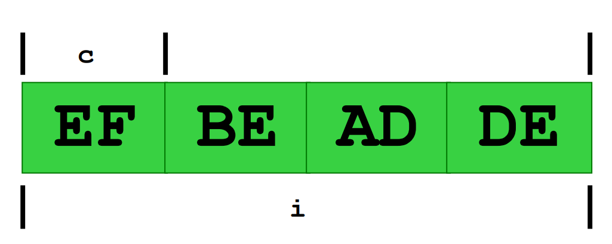
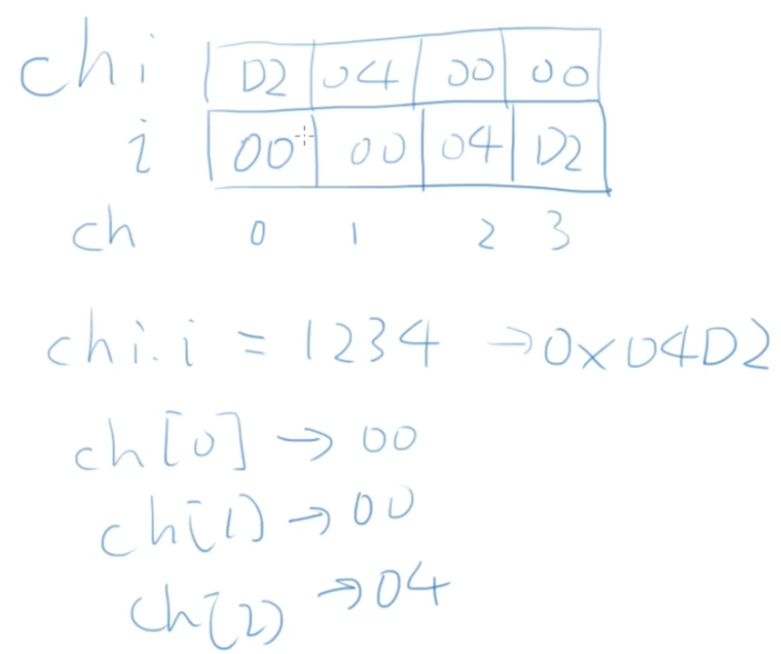

# 11.枚举、结构、联合


## 11.1 枚举

### 常量符号化

我们学常量的时候，我们知道⽤符号⽽不是具体的数字来表⽰程序中的数字，增强代码可读性。但是常量多的时候往往看起来可读性也不高，这个时候我们可以⽤枚举⽽不是定义独⽴的const int变量。

枚举是⼀种⽤户定义的数据类型，它⽤关键字 enum 以如下语法来声明：

- *enum* *枚举类型名字* {名字0, …, 名字n} ;

枚举类型名字通常并不真的使⽤，要⽤的是在⼤括号⾥的名字，因为它们就是就是常量符号，它们的类型int，值则依次从0到n。如：

- enum colors { red, yellow, green } ;

就创建了三个常量，red的值是0，yellow是1，⽽green是2。

当需要⼀些可以排列起来的常量值时，定义枚举的意义就是给了这些常量值名字。枚举的使用我们只需要知道以下三点

1. 枚举量可以作为值

2. 枚举类型可以跟上enum作为类型

3. 实际上是以整数来做内部计算和外部输⼊输出的

示例代码

```c
#include <stdio.h>

enum COLOR {RED, YELLOW, BLUE};

void f(enum color c);

int main(void) {
    enum color t = red;
    
    scanf("%d", &t);
    f(t);
    
    return 0;
}

void f(enum color c) {
    printf("%d\n", c);
}
```

套路：自动计数的枚举

```c
#include <stdio.h>

enum COLOR {RED, YELLOW, BLUE, NumCOLORS};

void f(enum COLOR c);

int main(void) {
    
    int color = -1;
    
    char *ColorNames[NumCOLORS] = {
        "red", "yellow", "blue"
    };
    char *colorName = NULL;
    
    printf("输入你喜欢的颜色的代码：");
    scanf("%d", &color);
    if (color >= 0 && color < NumCOLORS) {
        colorName = ColorNames[color];
    } else {
        colorName = "unknown";
    }
    printf("你喜欢的颜色是%s\n", colorName);
    
    return 0;
}
```

### 枚举量

声明枚举量的时候可以指定值

```c
enum COLOR {RED=1, YELLOW, BLUE = 5};
```

### 枚举只是int

即使给枚举类型的变量赋不存在的整数值也没有任何warning或error。

虽然枚举类型可以当作类型使⽤，但是实际上很(bu)少(hao)⽤，枚举在Pascal和FORTRAN的时候就诞生了。如果有意义上排⽐的名字，⽤枚举⽐const int⽅便。枚举⽐后面学习的宏（macro）好，因为枚举有int类型。

## 11.2 结构

### 声明结构

```c
struct date {
    int month;
    int day;
    int year;
}; // 初学者最常见错误就是漏了这个;
```

### 在函数内/外？

和本地变量⼀样，在函数内部声明的结构类型只能在函数内部使⽤。所以通常在函数外部声明结构类型，这样就可以被多个函数所使⽤了。

```c
#include <stdio.h>

struct date {
    int month;
    int day;
    int year;
};

int main(int argc, char const *argv[]) {
    struct date today;
    
    today.month = 07;
    today.day = 31;
    today.year = 2014;
    printf("Today's date is %d-%d-%d.\n", 
           today.year, today.month, today.day);
    return 0;
}
```

### 声明结构的形式

```c
struct point {
    int x;
    int y;
};
struct point p1, p2; // p1和p2都是point，里面有x和y的值
```

```c
struct {
    int x;
    int y;
} p1, p2; // p1和p2都是一种无名结构，里面有x和y
```

```c
struct point {
    int x;
    int y;
} p1, p2; // p1和p2都是point，里面有x和y
```

对于第⼀和第三种形式，都声明了结构point。但是第⼆种形式没有声明point，只是定义了两个变量

### 结构变量

```c
struct date today;

today.month=06；

today.day=19;

today.year=2005;
```

#### 结构变量初始化

````c
#include <stdio.h>

struct date {
    int month;
    int day;
    int year;
};

int main(int argc, char const *argv[]) {
    struct date today = {07, 31, 2014};
    struct date thismonth = {.month = 7, .year = 2014};
    
    printf("Today's date is %d-%d-%d.\n", 
           today.year, today.month, today.day);
    printf("This month is %d-%d-%d.\n", 
           thismonth.year, thismonth.month, thismonth.day);
    return 0;
}
````

### 结构成员

结构和数组有点像，数组用[]运算符和下标访问其中单元，结构用.运算符和名字访问其成员

```c
today.day;
student.firstName;
p1.x;
p1.y;
```

### 结构计算

要访问整个结构，直接⽤结构变量的名字。对于整个结构，可以做赋值、取地址，也可以传递给函数参数。

```c
p1 = (struct point) {5, 10}; // 相当于p1.x = 5; p1.y = 10;
p1 = p2; // 相当于p2.x = p1.x; p2.y = p1.y;
```

回想，数组无法做这两种运算！

### 符合字面量

```c
today = (struct date) {9, 25, 2004};
today = (struct date) {.month=9, .day=25, .year=2004};
```

### 结构指针

和数组不同，结构变量的名字并不是结构变量的地址，必须使⽤&运算符

```c
struct date *pDate = &today;
```

### 结构与函数

#### 结构作为函数参数

整个结构可以作为参数的值传⼊函数。这时候是在函数内新建⼀个结构变量，并复制调⽤者的结构的值，也可以返回⼀个结构，这与数组完全不同。

#### 输入结构

没有直接的⽅式可以⼀次scanf⼀个结构。那么如果我们打算写⼀个函数来读⼊结构，但是读⼊的结构如何送回来呢？一个例子如下

```c
#include <stdio.h>

struct point {
    int x;
    int y;
};

void getStruct(struct point p);
void output(struct point p);

int main(void) {
    struct point y = {0, 0};
    getStruct(y);
    output(y);
}

void getStruct(struct point p) {
    scanf("%d", &p.x);
    scanf("%d", &p.y);
    printf("%d,%d", p.x, p.y);
}

void output(struct point p) {
    printf("%d,%d", p.x, p.y);
}
```

记住C语言在函数调⽤时是传值的

- 所以函数中的p与main中的y是不同的
- 在函数读⼊了p的数值之后，没有任何东⻄回到main，所以y还是 {0, 0}

##### 解决方案

之前的⽅案，把⼀个结构传⼊了函数，然后在函数中操作，但是没有返回回去

- 问题在于传⼊函数的是外⾯那个结构的克隆体，⽽不是指针
- 传⼊结构和传⼊数组是不同的

在这个输⼊函数中，完全可以创建⼀个临时的结构变量，然后把这个结构返回给调⽤者

### 结构指针作为参数

#### 指向结构的指针

```c
struct date {
    int month;
    int day;
    int year;
} myday;

struct date*p = &myday;

(*p).month = 12;
p->month = 12;
```

我们可以⽤->表⽰指针所指的结构变量中的成员。

#### 结构指针参数

好处是传⼊传出只是⼀个指针的⼤⼩，如果需要保护传⼊的结构不被函数修改，就需要const指针

```c
const struct point *p;
```

返回传⼊的指针也是⼀种套路

```c
struct point* inputPoint(struct point *p) {
    scanf("%d", &(p->x));
    scanf("%d", &(p->y));
    return p;
}
```

### 结构数组

结构是一种数据类型，也可以有数组。

```c
struct date dates[100];
struct date dates[] = {{4, 5, 2005}, {2, 4, 2005}};
```

### 嵌套结构

结构还可以进行嵌套

```c
struct dateTime {
    struct date sdate;
    struct time stime;
}
```

```c
struct point {
    int x;
    int y;
};

struct rectangle {
    struct point p1;
    struct point p2;
};

struct rectangle r;
r.p1.x;
r.p1.y;
r.p2.x;
r.p2.y;
```

注意->和.运算符的区别，一个是指针还有一个是数据类型

```c
struct rectangle r, *rp;
rp = &r;

// 以下四种表达等价
r.p1.x;
rp->p1.x;
(r.p1).x;
(rp->p1).x;
// 注意没有rp->p1->x，因为p1不是指针
```

#### 嵌套结构数组

```c
#include <stdio.h>

struct point {
    int x;
    int y;
};

struct rectangle {
    struct point p1;
    struct point p2;
};

void printRect(struct rectangle r) {
    printf("<%d,%d> to <%d,%d>\n", r.p1.x, r.p1.y, r.p2.x, r.p2.y);
}

int main(void) {
    struct rectangle rects[] = {{{1, 2}, {3, 4}}, {{5, 6}, {7, 8}}}; // 2 rectangles
    for (int i = 0; i < 2; i++) {
        printRect(rects[i]);
    }
}
```

## 11.3 类型定义

### 自定义数据类型typedef

C语⾔提供了⼀个叫做 typedef 的功能来声明⼀个已有的数据类型的新名字。⽐如：

```c
typedef int Length;
```

使得Length成为 int 类型的别名。

这样，Length 这个名字就可以代替int出现在变量定义和参数声明的地⽅了：

```c
Length a, b, len;

Length numbers[10];
```

### typedef

声明新的类型的名字

- 新的名字是某种类型的别名
- 改善了程序的可读性

```c
typedef long int64_t; // 重载已有的类型名字，新名字的含义更清晰，具有可移植性
typedef struct ADate {
 int month;
 int day;
 int year;
} Date; // 简化了复杂的名字

int64_t i = 100000000000;
Date d = {9, 1, 2005};
```

```c
typedef int Length; // Length就等价于int类型
typedef *char[10] Strings; // Strings是10个字符串的数组的类型
typedef struct node {
	int data;	 	 	
	struct node *next;
} aNode;	
// 或
typedef struct node aNode; // 这样⽤aNode就可以代替
struct node
```

## 11.4 联合

联合也是一种数据类型，参考例子如下

```c
union AnElt {
 	int i;
 	char c;
} elt1, elt2;
elt1.i = 4;
elt2.c = ’a’;
elt2.i = 0xDEADBEEF;
```

里面的成员是⼀个int i还是⼀个char c？

sizeof(union …) = sizeof(每个成员)的最⼤值，内存图如下



### 存储

1. 所有的成员共享⼀个空间

2. 同⼀时间只有⼀个成员是有效的 

3. union的⼤⼩是其最⼤的成员

### 初始化

对第一个成员做初始化

程序怎么能知道上面elt1和elt2⾥⾯到底是int还是char？

答案，union⾃⼰也并不知道当时其中哪个成员是有效的。

最好的答案：另⼀个变量来表达这个事情。

### Union的用处

```c
#include <stdio.h>

typedef union {
    int i;
    char ch[sizeof(int)];
} CHI;

int main(void) {
    CHI chi;
    int i;
    chi.i = 1234;
    for (i = 0; i < sizeof(int); i++) {
        printf("%02hhX", chi.ch[i]);
    }
    printf("\n");
    
    return 0;
}
```

这个结果表明我们所⽤的CPU是⼩端的，有兴趣的同学可以参考[大小端问题](https://zhuanlan.zhihu.com/p/51029145)和下图



对于union的其他作用，大家可以参考[When would anyone use a union? Is it a remnant from the C-only days?](https://stackoverflow.com/questions/4788965/when-would-anyone-use-a-union-is-it-a-remnant-from-the-c-only-days)，[Why do we need C Unions?](https://stackoverflow.com/questions/252552/why-do-we-need-c-unions)，[Purpose of Unions in C and C++](https://stackoverflow.com/questions/2310483/purpose-of-unions-in-c-and-c)

## 11.5 第十一章练习

1. struct实现一个同学通讯录
2. enum实现一个简单日历/月历，输入数字输出天数，输入数字输出月份