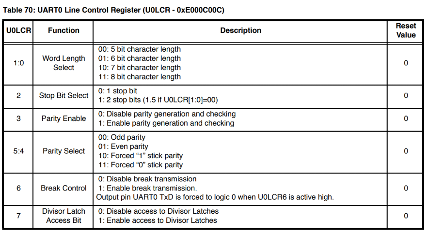

# 13.输入输出和位运算

- [13.输入输出和位运算](#13%e8%be%93%e5%85%a5%e8%be%93%e5%87%ba%e5%92%8c%e4%bd%8d%e8%bf%90%e7%ae%97)
  - [13.0 理解流](#130-%e7%90%86%e8%a7%a3%e6%b5%81)
  - [13.1 格式化输入输出](#131-%e6%a0%bc%e5%bc%8f%e5%8c%96%e8%be%93%e5%85%a5%e8%be%93%e5%87%ba)
    - [printf](#printf)
      - [%\[flags]\[width]\[.prec][hlL]type](#flagswidthprectype)
    - [scanf](#scanf)
    - [[^.]](#)
    - [printf和scanf的返回值](#printf%e5%92%8cscanf%e7%9a%84%e8%bf%94%e5%9b%9e%e5%80%bc)
    - [scanf代替品](#scanf%e4%bb%a3%e6%9b%bf%e5%93%81)
  - [13.2 文件输入输出](#132-%e6%96%87%e4%bb%b6%e8%be%93%e5%85%a5%e8%be%93%e5%87%ba)
    - [输入结束](#%e8%be%93%e5%85%a5%e7%bb%93%e6%9d%9f)
    - [FILE*](#file)
    - [打开文件的标准代码](#%e6%89%93%e5%bc%80%e6%96%87%e4%bb%b6%e7%9a%84%e6%a0%87%e5%87%86%e4%bb%a3%e7%a0%81)
    - [fopen](#fopen)
  - [13.3 二进制文件](#133-%e4%ba%8c%e8%bf%9b%e5%88%b6%e6%96%87%e4%bb%b6)
    - [文本vs二进制](#%e6%96%87%e6%9c%acvs%e4%ba%8c%e8%bf%9b%e5%88%b6)
    - [程序为什么要文本](#%e7%a8%8b%e5%ba%8f%e4%b8%ba%e4%bb%80%e4%b9%88%e8%a6%81%e6%96%87%e6%9c%ac)
    - [二进制读写](#%e4%ba%8c%e8%bf%9b%e5%88%b6%e8%af%bb%e5%86%99)
    - [为什么nitems？](#%e4%b8%ba%e4%bb%80%e4%b9%88nitems)
    - [在文件中定位](#%e5%9c%a8%e6%96%87%e4%bb%b6%e4%b8%ad%e5%ae%9a%e4%bd%8d)
    - [可移植性](#%e5%8f%af%e7%a7%bb%e6%a4%8d%e6%80%a7)
  - [13.4 *位运算](#134-%e4%bd%8d%e8%bf%90%e7%ae%97)
    - [按位运算](#%e6%8c%89%e4%bd%8d%e8%bf%90%e7%ae%97)
      - [&](#-1)
      - [|](#-2)
      - [~](#-3)
    - [^](#-4)
    - [<<](#-5)
    - [>>](#blockquote-blockquoteblockquote-blockquote)
    - [no zuo no die](#no-zuo-no-die)
    - [逻辑运算vs位运算](#%e9%80%bb%e8%be%91%e8%bf%90%e7%ae%97vs%e4%bd%8d%e8%bf%90%e7%ae%97)
    - [MCU的特殊功能寄存器](#mcu%e7%9a%84%e7%89%b9%e6%ae%8a%e5%8a%9f%e8%83%bd%e5%af%84%e5%ad%98%e5%99%a8)
      - [位段](#%e4%bd%8d%e6%ae%b5)
  - [13.5 第十三章练习](#135-%e7%ac%ac%e5%8d%81%e4%b8%89%e7%ab%a0%e7%bb%83%e4%b9%a0)

## 13.0 理解流

[如何理解编程语言中「流」（stream）的概念？](https://www.zhihu.com/question/27996269)

[What does 'stream' mean in C?](https://stackoverflow.com/questions/38652953/what-does-stream-mean-in-c)

## 13.1 格式化输入输出

### printf

```c
%[flags][width][.prec][hlL]type
```

#### %\[flags]\[width]\[.prec][hlL]type

| Flag    | 含义         |
| ------- | ------------ |
| -       | 左对齐       |
| +       | 在前面放+或- |
| (space) | 整数留空     |
| 0       | 0填充        |

| width或prec | 含义                       |
| ----------- | -------------------------- |
| number      | 最小字符数                 |
| *           | 下一个参数是字符数         |
| .number     | 小数点后的位数             |
| .*          | 下一个参数是小数点后的位数 |

| 类型修饰 | 含义        |
| -------- | ----------- |
| hh       | 单个字节    |
| h        | short       |
| l        | long        |
| ll       | long long   |
| L        | long double |

| type | 用于               | type | 用于            |
| ---- | ------------------ | ---- | --------------- |
| i或d | int                | g    | float           |
| u    | unsigned int       | G    | float           |
| o    | 八进制             | a或A | 十六进制浮点    |
| x    | 十六进制           | c    | char            |
| X    | 字母大写的十六进制 | s    | 字符串          |
| f或F | float，6           | p    | 指针            |
| e或E | 指数               | n    | 读入/写出的个数 |

### scanf

```c
%[flag]type
```

| flag | 含义       | flag | 含义         |
| ---- | ---------- | ---- | ------------ |
| *    | 跳过       | l    | long，double |
| 数字 | 最大字符数 | ll   | long long    |
| hh   | char       | L    | long double  |
| h    | short      |      |              |

| type       | 用于                         | type  | 用于         |
| ---------- | ---------------------------- | ----- | ------------ |
| d          | int                          | s     | 字符串       |
| i          | 整数，可能为十六进制或八进制 | [...] | 所允许的字符 |
| u          | unsigned int                 | p     | 指针         |
| o          | 八进制                       |       |              |
| x          | 十六进制                     |       |              |
| a，e，f，g | float                        |       |              |
| c          | char                         |       |              |

### [^.]

```c
$GPRMC,004319.00,A,3016.98468,N,12006.39211,E,0.047,,130909,,,D*79 // GPS数据输入
scanf("%*[^,],%[^,],%[^,],%[^,],%[^,],%[^,],%[^,],%[^,],%[^,],%[^,]",
sTime,sAV,sLati,&sNW,sLong,&sEW,sSpeed,sAngle,sDate);
```

### printf和scanf的返回值

scanf返回读⼊的项目数。

printf返回输出的字符数。

在要求严格的程序中，应该判断每次调⽤scanf或printf的返回值，从⽽了解程序运⾏中是否存在问题。

### scanf代替品

在实际应用中，scanf往往会导致各种问题，推荐使用fgets而非scanf，具体可参照[Disadvantages of scanf](https://stackoverflow.com/questions/2430303/disadvantages-of-scanf)

## 13.2 文件输入输出

⽤>和<做重定向

### 输入结束

getchar读到了EOF，scanf返回⼩于要求读的数量。

### FILE*

```c
FILE* fopen(const char *restrict path, const char *restrict mode); 

int fclose(FILE *stream);

fscanf(FILE*, ...)

fprintf(FILE*, ...)
```

### 打开文件的标准代码

```c
FILE* fp = fopen("file", "r");

if ( fp ) { 

    fscanf(fp,...); 

    fclose(fp); 

} else { 

    ... 

}
```

### fopen

| 模式 | 作用                                               |
| ---- | -------------------------------------------------- |
| r    | 打开只读                                           |
| r+   | 打开读写，从文件头开始                             |
| w    | 打开只写。如果不存在则新建，如果存在则清空         |
| w+   | 打开读写。如果不存在则新建，如果存在则清空         |
| a    | 打开追加。如果不存在则新建，如果存在则从文件尾开始 |
| ..x  | 只新建，如果文件已存在则不能打开                   |

## 13.3 二进制文件

其实所有的⽂件最终都是⼆进制的，⽂本⽂件⽆⾮是⽤最简单的⽅式可以读写的⽂件。以下命令可以用来查看文本文件。

- more、tail
- cat
- vi

⽽⼆进制⽂件是需要专⻔的程序来读写的⽂件。⽂本⽂件的输⼊输出是格式化，可能经过转码。

### 文本vs二进制

Unix喜欢⽤⽂本⽂件来做数据存储和程序配置

- 交互式终端的出现使得⼈们喜欢⽤⽂本和计算机 “talk”
- Unix的shell提供了⼀些读写⽂本的⼩程序

Windows喜欢⽤⼆进制⽂件

- DOS是草根⽂化，并不继承和熟悉Unix⽂化
- PC刚开始的时候能⼒有限，DOS的能⼒更有限，⼆进制更接近底层

⽂本的优势是⽅便⼈类读写，⽽且跨平台

⽂本的缺点是程序输⼊输出要经过格式化，开销⼤

⼆进制的缺点是⼈类读写困难，⽽且不跨平台

- int的⼤⼩不⼀致，⼤⼩端的问题...

⼆进制的优点是程序读写快

### 程序为什么要文本

配置

- Unix⽤⽂本，Windows⽤注册表

数据

- 稍微有点量的数据都放数据库了

媒体

- 这个只能是⼆进制的

现实是，程序通过第三⽅库来读写⽂件，很少直接读写⼆进制⽂件了

### 二进制读写

```c
size_t fread(void *restrict ptr, size_t size, size_t nitems, FILE *restrict stream);

size_t fwrite(const void *restrict ptr, size_t size, size_t nitems, FILE *restrict stream);
```

注意FILE指针是最后⼀个参数，返回的是成功读写的字节数

### 为什么nitems？

因为⼆进制⽂件的读写⼀般都是通过对⼀个结构变量的操作来进⾏的，于是nitem就是⽤来说明这次读写⼏个结构变量！

### 在文件中定位

```c
long ftell(FILE *stream);

int fseek(FILE *stream, long offset, int whence);

// SEEK_SET：从头开始

// SEEK_CUR：从当前位置开始

// SEEK_END：从尾开始（倒过来）
```

### 可移植性

这样的⼆进制⽂件不具有可移植性，在int为32位的机器上写成的数据⽂件⽆法直接在int为64位的机器上正确读出。

解决⽅案之⼀是放弃使⽤int，⽽是typedef具有明确⼤⼩的类型，更好的⽅案是⽤⽂本。

## 13.4 *位运算

### 按位运算

C有这些按位运算的运算符：

| 运算符 | 作用     |
| ------ | -------- |
| &      | 按位的与 |
| \|     | 按位的或 |
| ~      | 按位取反 |
| ^      | 按位异或 |
| <<     | 左移     |
| >>     | 右移     |

#### &

$$
如果x_i==1且y_i==1，那么(x\& y)_i=1，否则(x\& y)_i=0
$$

应用

1. 让某⼀位或某些位为0：x & 0xFE
2. 取⼀个数中的⼀段：x & 0xFF

#### |

$$
如果x_i==1且y_i==1，那么(x|y)_i=1，否则(x|y)_i=0
$$

应用

1. 使得⼀位或⼏个位为1：x | 0x01
2. 把两个数拼起来：0x00FF | 0xFF00

#### ~

$$
\sim x_i=1-x_i
$$

把1位变0，0位变1

想得到全部位为1的数：~0

7的⼆进制是0111，x | 7使得低3位为1，⽽x & ~7，就使得低3位为0

### ^

$$
如果x_i==y_i，那么(x\wedge y)_i=0，否则(x\wedge y)_i=1
$$

如果两个位相等，那么结果为0；不相等，结果为1

如果x和y相等，那么x ^ y的结果为0

对⼀个变量⽤同⼀个值异或两次，等于什么也没做

```c
x^y^y==x
```

### <<

```c
i << j // i中所有的位向左移动j个位置，⽽右边填⼊0

x <<= 1 // x *= 2

x <<= n // x *= 2n
```

所有⼩于int的类型，移位以int的⽅式来做，结果是int

### >>

```c
i >> j // i中所有的位向右移动j个位置

x >>= 1 // x /= 2

x >>= n // x /= 2n
```

所有⼩于int的类型，移位以int的⽅式来做，结果是int

对于unsigned的类型，左边填⼊0

对于signed的类型，左边填⼊原来的最⾼位（保持符号不变）

### no zuo no die

移位的位数不要⽤负数，这是没有定义的⾏为

```c
x << -2 // !!NO!!
```

### 逻辑运算vs位运算

对于逻辑运算，它只看到两个值：0和1

可以认为逻辑运算相当于把所有⾮0值都变成1，然后做按位运算

```c
/*
5 & 4 ->4
5 && 4 -> 1 & 1 -> 1

5 | 4 -> 5
5 || 4 -> 1 | 1 -> 1

~4 -> 3
!4 -> !1 -> 0
*/
```

### MCU的特殊功能寄存器



#### 位段

把⼀个int的若干位组合成⼀个结构

```c
struct { 

     unsigned int leading : 3; 

     unsigned int FLAG1: 1; 

     unsigned int FLAG2: 1; 

     int trailing: 11; 

};
```

可以直接⽤位段的成员名称来访问

- ⽐移位、与、或还⽅便

编译器会安排其中的位的排列，不具有可移植性，当所需的位超过⼀个int时会采⽤多个int

## 13.5 第十三章练习

1. 探究printf、fprintf、sprintf的区别
2. 探究gets、fgets、puts、fputs的区别
3. 输出一个数的二进制