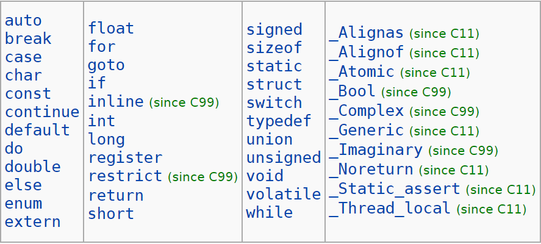
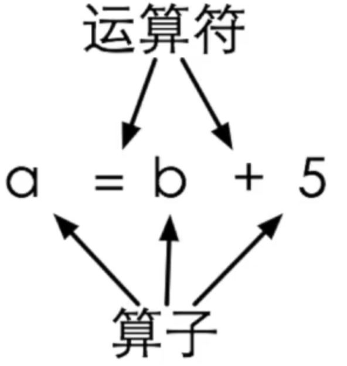
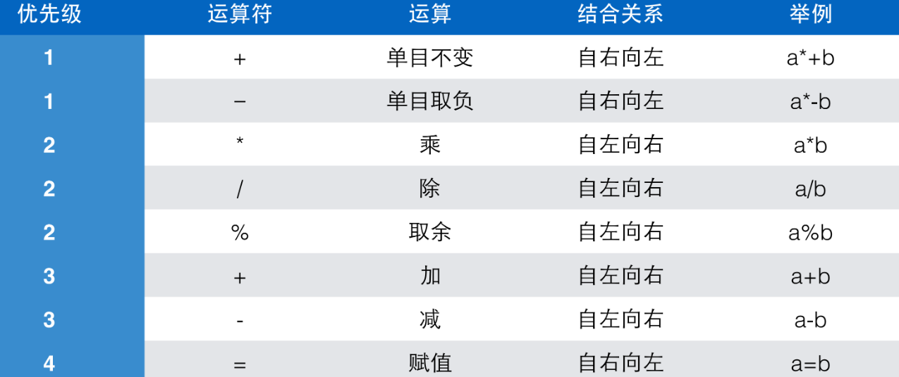

# 02.变量、常量及表达式

- [02.变量、常量及表达式](#02%e5%8f%98%e9%87%8f%e5%b8%b8%e9%87%8f%e5%8f%8a%e8%a1%a8%e8%be%be%e5%bc%8f)
	- [02.1 变量](#021-%e5%8f%98%e9%87%8f)
		- [变量定义](#%e5%8f%98%e9%87%8f%e5%ae%9a%e4%b9%89)
			- [变量名称](#%e5%8f%98%e9%87%8f%e5%90%8d%e7%a7%b0)
				- [C语言保留字](#c%e8%af%ad%e8%a8%80%e4%bf%9d%e7%95%99%e5%ad%97)
				- [*好的变量命名规范](#%e5%a5%bd%e7%9a%84%e5%8f%98%e9%87%8f%e5%91%bd%e5%90%8d%e8%a7%84%e8%8c%83)
			- [变量类型](#%e5%8f%98%e9%87%8f%e7%b1%bb%e5%9e%8b)
		- [变量赋值和初始化](#%e5%8f%98%e9%87%8f%e8%b5%8b%e5%80%bc%e5%92%8c%e5%88%9d%e5%a7%8b%e5%8c%96)
		- [赋值](#%e8%b5%8b%e5%80%bc)
		- [初始化](#%e5%88%9d%e5%a7%8b%e5%8c%96)
			- [假如不初始化？](#%e5%81%87%e5%a6%82%e4%b8%8d%e5%88%9d%e5%a7%8b%e5%8c%96)
			- [变量初始化](#%e5%8f%98%e9%87%8f%e5%88%9d%e5%a7%8b%e5%8c%96)
	- [02.2 表达式简介](#022-%e8%a1%a8%e8%be%be%e5%bc%8f%e7%ae%80%e4%bb%8b)
	- [02.3 读取输入](#023-%e8%af%bb%e5%8f%96%e8%be%93%e5%85%a5)
		- [如果没有按照格式输入？](#%e5%a6%82%e6%9e%9c%e6%b2%a1%e6%9c%89%e6%8c%89%e7%85%a7%e6%a0%bc%e5%bc%8f%e8%be%93%e5%85%a5)
	- [02.4 常量](#024-%e5%b8%b8%e9%87%8f)
		- [const](#const)
	- [02.5 浮点数](#025-%e6%b5%ae%e7%82%b9%e6%95%b0)
		- [从单位转换开始](#%e4%bb%8e%e5%8d%95%e4%bd%8d%e8%bd%ac%e6%8d%a2%e5%bc%80%e5%a7%8b)
		- [整数除法](#%e6%95%b4%e6%95%b0%e9%99%a4%e6%b3%95)
		- [浮点数](#%e6%b5%ae%e7%82%b9%e6%95%b0)
		- [计算机为什么要纯粹的整数](#%e8%ae%a1%e7%ae%97%e6%9c%ba%e4%b8%ba%e4%bb%80%e4%b9%88%e8%a6%81%e7%ba%af%e7%b2%b9%e7%9a%84%e6%95%b4%e6%95%b0)
	- [02.6 表达式和运算符](#026-%e8%a1%a8%e8%be%be%e5%bc%8f%e5%92%8c%e8%bf%90%e7%ae%97%e7%ac%a6)
		- [表达式](#%e8%a1%a8%e8%be%be%e5%bc%8f)
		- [运算符](#%e8%bf%90%e7%ae%97%e7%ac%a6)
		- [计算时间差](#%e8%ae%a1%e7%ae%97%e6%97%b6%e9%97%b4%e5%b7%ae)
		- [求平均值](#%e6%b1%82%e5%b9%b3%e5%9d%87%e5%80%bc)
		- [运算符优先级](#%e8%bf%90%e7%ae%97%e7%ac%a6%e4%bc%98%e5%85%88%e7%ba%a7)
			- [单目运算符](#%e5%8d%95%e7%9b%ae%e8%bf%90%e7%ae%97%e7%ac%a6)
			- [赋值运算符](#%e8%b5%8b%e5%80%bc%e8%bf%90%e7%ae%97%e7%ac%a6)
		- [结合关系](#%e7%bb%93%e5%90%88%e5%85%b3%e7%b3%bb)
		- [小练习](#%e5%b0%8f%e7%bb%83%e4%b9%a0)
			- [计算复利](#%e8%ae%a1%e7%ae%97%e5%a4%8d%e5%88%a9)
			- [交换两个变量](#%e4%ba%a4%e6%8d%a2%e4%b8%a4%e4%b8%aa%e5%8f%98%e9%87%8f)
			- [复合赋值运算符](#%e5%a4%8d%e5%90%88%e8%b5%8b%e5%80%bc%e8%bf%90%e7%ae%97%e7%ac%a6)
			- [递增递减运算符](#%e9%80%92%e5%a2%9e%e9%80%92%e5%87%8f%e8%bf%90%e7%ae%97%e7%ac%a6)
				- [前缀后缀](#%e5%89%8d%e7%bc%80%e5%90%8e%e7%bc%80)
				- [不要组合进表达式](#%e4%b8%8d%e8%a6%81%e7%bb%84%e5%90%88%e8%bf%9b%e8%a1%a8%e8%be%be%e5%bc%8f)
	- [02.7 第二章练习](#027-%e7%ac%ac%e4%ba%8c%e7%ab%a0%e7%bb%83%e4%b9%a0)

## 02.1 变量

上一章我们学习了简单的C语言程序框架，并且能让它进行简单的输出和计算。

现在，我们想写一个简单的找零程序，假设总量是100，然后收钱23，我们稍微修改printf如下即可

```c
printf("100-23=%d\n", 100 - 23);
```

<u>***演示***</u>得到了77的正确结果。

然而，我们希望程序能够在运行时通过用户输入金额来确定找零。比如说23这个数并不出现在程序中，而是由用户输入。这样我们不需要每次通过编辑程序代码（这种方式通常叫硬编码）来计算找零，这样可以使程序更加灵活多样性，不需要经常修改。

为了达到这个目的，我们需要做3件事情：

1. 有地⽅放输⼊的数字
2. 有办法输⼊数字
3. 输⼊的数字能参与计算

示例代码如下

```c
#include <stdio.h>

int main(void) {
    int price = 0;

    printf("请输入金额（元）：");
    scanf("%d", &price);

    int change = 100 - price;

    printf("找您%d元。\n", change);
    return 0;
}
```

这段代码相信大家已经尝试编译运行过了，我在这里再<u>***演示***</u>一次，输入23，按下回车，得到结果77。

为何需要按下回车这个操作，我们以后会再详细讲述。但是在日常使用软件的实践中我们经常都会用回车来代表这个动作或者事件已经完成了。

对于输入，我们暂时只需要知道

1. 输⼊也在终端窗⼝中
2. 输⼊是以⾏为单位进⾏的，⾏的结束标志就是你按下了回⻋键。在你按下回⻋之前，你的程序不会读到任何东⻄。

回到程序本身，我们输入的数值在哪呢？其实，它被储存在变量中，我们先看下面这一行

```c
int price = 0;
```

这⼀⾏的意思是：定义了⼀个变量。变量的名字是 price，类型是int，初始值是0。

类型我们会之后再阐释，我们先探究变量是什么？

变量是⼀个保存数据的地⽅，当我们需要在程序⾥保存数据时，⽐如上⾯的例⼦中要记录⽤户输⼊的价格，就需要⼀个变量来保存它。⽤⼀个变量保存了数据，它才能参加到后⾯的计算中，⽐如计算找零。

### 变量定义

一般形式：*类型名称* *变量名称*;

比如说：

```c
int price;
int amount;
int checkin, checkout;
```

对于程序而言，定义变量也算是一种操作，因此要以;结尾。在最后一个例子中我们发现，定义多个相同类型的变量时，我们可以使用,分隔不同的变量减少重复输入类型名称。

#### 变量名称

1. 变量需要⼀个名字，变量的名字是⼀种 “标识符”，意思是它是⽤来识别这个和那个的不同的名字。（可以类比理解为人的身份证号，只是用其他形式表达）
2. 标识符有标识符的构造规则。基本的原则是：标识符只能由字⺟、数字和下划线组成，数字不可以出现在第⼀个位置上，C 语⾔的关键字（有的地⽅叫它们保留字）不可以⽤做标识符。

下面是一些常见的例子

:heavy_check_mark:int haha;

:heavy_check_mark:int haha1;

:heavy_check_mark:int digit1;

:heavy_check_mark:int _happy;

:x:int 1digit;

:x:int comm!a;

***注意：有的编译器允许使用中文作为变量名，但请在实践中不要这么做。这是所谓的编译器未定义行为（Undefined Behavior，俗称UB），我们无法保证或者期待这种行为会得到广泛的支持。***

##### C语言保留字 

下面是一些C语言的保留字和参考链接，我们并不需要背诵，在后面的学习中我们会接触到其中的大部分（编译器也大多会提示或者报错）。我们只需要知道不要用保留字拿来作变量的标识符即可。

[C key word](https://en.cppreference.com/w/c/keyword)



##### *好的变量命名规范

1. 自说明
2. 不要使用汉语拼音
3. 不要使用迷之简写
4. 不要使用无意义命名
5. 不要使用可能带有歧义的名字

参考自[大胖逼逼叨15-程序员改掉这些陋习 轻松涨薪5000元](https://www.bilibili.com/video/av85133385)

#### 变量类型

对于

```c
int price = 0;
```

我们来研究一下这个int。C语言是⼀种有类型的语⾔，所有的变量在使⽤之前必须定义或声明，所有的变量必须具有确定的数据类型。数据类型表⽰在变量中可以存放什么样的数据，变量中只能存放指定类型的数据，程序运⾏过程中也不能改变变量的类型。

price是第一个变量，第二个变量是change，并且用来保存计算的结果。

一个程序中可以存在多个变量，当我们有需要时就可以定义一个新的变量。

注意，change是在程序中间定义的，这是C99标准所新增的。C89（ANSI C）是不支持进行这种操作的，必须定义在程序的开头。

在C89中，一旦开始进行操作比如输入、输出或者计算的时候就不允许定义新的变量了。本课使用教材就参照了C89标准，但是同学们使用C99标准即可。C标准是向前兼容的，因此有偏爱C89标准的同学也可以按照C89标准进行C程序编写。


### 变量赋值和初始化

我们回到这一行

```c
int price = 0;
```

这里price = 0的意思和数学上的等于并不一样，在C语言中它表达的是赋值的意思：即把0这个值赋予给price这个变量。

通用的来讲，这⾥的“＝”是⼀个赋值运算符，表⽰将“＝”右边的值赋给左边的变量。

因为我们在定义price这个变量的时候也将其赋值，这种行为我们称之为初始化。在C语言中赋值和初始化的差别并不大，但在一些其他语言例如C++会有所区别。

### 赋值

和数学不同，a=b在数学中表⽰关系，即a和b的值⼀样；⽽在程序设计中，a=b表⽰ 要求计算机做⼀个动作：将b的值赋给a。 关系是静态的，⽽动作是动态的。在数学中，a=b和b=a是等价的，⽽在程序设计中，两者的意思完全相反。

### 初始化

当赋值发⽣在定义变量的时候，就是变量的初始化。虽然C语⾔并没有强制要求所有的变量都在定义的地⽅做初始化（但我一般推荐进行初始化），但是所有的变量在第⼀次被使⽤（出现在赋值运算符的右边）之前应该赋值⼀次。

#### 假如不初始化？

有的同学可能想知道如果变量不初始化就拿来使用会有什么后果，在多平台<u>***演示***</u>，不确定行为。

初始化后再在多平台<u>***演示***</u>，结果正常。

那么这是为什么呢，因为变量是储存在内存（即1.1中的RAM）中的，如果不进行初始化，那么默认就是变量所在的地方里的原来的值。如果大家在自己的电脑上运行，可能会有不同的结果。因为这取决于原来那个地方的值，那个值***对我们的程序而言***是未定义的。因此，不进行初始化就使用的行为也属于上面所提到的未定义行为UB的一种。

举个例子，大家在搬进新宿舍的时候没有进行打扫清洁，那么里面所有的垃圾（对应的就是那些奇怪的数）都是自己的了。

#### 变量初始化

*类型名称* *变量名称* = *初始值*;

例如

```c
int price = 0;
int amount = 100;
```

定义多个变量的时候，也可以在这个定义中单独给单个变量赋初值，如：

```c
int price = 0, amount = 100;
```

注意变量名称依然遵守命名规则，并无例外。

## 02.2 表达式简介

还是这一行

```c
int price = 0;
```

“＝”是赋值运算符（先不需要理解运算符的意思，知道是个符号即可），有运算符的式⼦就叫做表达式。

```c
price = 0;
change = 100 - price;
```

这些都属于表达式。

## 02.3 读取输入

定义了price变量后，我们是如何将用户的输入放入到price中的呢？参考下面这一行

```c
scanf("%d", &price);
```

我们需要用到scanf函数，printf其实也是一个函数，我们程序框架里的main也是一个函数。然而同学们暂时还不需要明白函数的概念，我们暂时只需要知道printf是用于输出的函数，scanf是用于输入的函数即可。

scanf、printf这两个函数最后的字母f代表formatted，即格式化的，像之前用到的%d之类的都属于一种格式，叫格式字符串。

总而言之，我们要求scnaf这个函数读⼊⼀个整数，把读到的结果赋值给变量price。记住price前有一个&符号，我们暂时不需要知道&的作用和意义（在后面的指针中会学习到），只需要知道必须加在变量名前才能正确获取数据即可。否则无法正确读取输入，甚至会导致程序崩溃。

### 如果没有按照格式输入？

进行<u>***演示***</u>

在后面具体的输入和输出讲解中，我们会讲解如何知道用户输入的具体是什么值。

## 02.4 常量

```c
int change = 100 - price;
```

在这行程序中，100这个固定不变的数，叫做常数。直接写在程序⾥，我们称作直接量（literal，字⾯量）。

对于常量，有时候直接使用会造成困惑。

比如众所周知，π约等于3.14，如果程序中出现了3.14，大家很容易推断出这个是π。

但是如果出现了2.718，恐怕大家就很难直接反应过来这代表了什么，这其实是自然对数e。

在C语言中，我们习惯于把常数定义成常量有助于大家理解。如果不定义的话常常会使人觉得比较突兀，是奇数（Magic Number），不方便理解。

因此，更好的形式，是把这个100定义成常量：

```c
const int AMOUNT = 100;
```

对于常量，变量名我们通常使用字母全部大写来表示，这会在程序中比较显眼，方便调试。

修改之后代码如下

```c
#include <stdio.h>

int main(void) {
    const int AMOUNT = 100;
    int price = 0;

    printf("请输入金额（元）：");
    scanf("%d", &price);

    int change = AMOUNT - price;

    printf("找您%d元。\n", change);
    return 0;
}
```

如此一来大家就知道100表示的是什么意思了。而且我们把AMOUNT放在最前面，这样我们以后要找到并修改的时候就十分方便。

### const

const是⼀个修饰符，加在int的前⾯，⽤来 给这个变量加上⼀个const（不变的）的属性。这个const的属性表⽰这个变量的值⼀旦初始化，就不能再修改了。

注意，这也是C99标准的新增内容，C89中没有这个关键字。

而且，常量必须要初始化，因为常量无法后续赋值。

<u>***演示***</u>赋值修改常量

编译器提示只读的变量无法被赋值。因此，如果你试图对常量做修改，把它放在赋值运算符的左边，就会被编译器发现，指出为⼀个错误。

现在，我们想让用户输入AMOUNT而不是使⽤固定的初始值。我们应该如何修改呢？

```c
#include <stdio.h>

int main(void) {
	int amount = 0, price = 0;
	
	printf("请输入金额（元）：");
	scanf("%d", &price);
	
	printf("请输入票面（元）：");
	scanf("%d", &amount);
	
	int change = amount - price;
	
	printf("找您%d元。\n", change);
	
	return 0;
}
```

我们将常量改成变量amount，然后再次通过scanf读入amount的值即可。

当然，有时为了省事，我们也可以使用一个scanf去完成，比如如下的代码计算两个变量的和

```c
include <stdio.h>

int main(void) {
	int a;
	int b;

	printf("请输入两个整数：");
	scanf("%d %d", &a, &b);
	printf("%d + %d = %d\n", a, b, a + b);

	return 0;
}
```

我们可以把两个变量都从一个scanf中读取变量。记住两个%d之间有个空格，这个是有讲究的，但是具体内容不在这里展开，我们会在讲输入输出的时候具体解释。

因为有两个%d，所以我们有两个变量，变量之间同样用,分隔，记得变量名前要用&符号。读取的第一个数字会存在a中，第二个数字会存在b中。

在printf中也比较复杂，我们有3个%d，程序会依次填入后面的三个值，对应a，b，a+b的结果。我们1.3的时候尝试打印两个常数的相加，因此两个变量的相加这种表达式也是可以在printf中打印出来的。

我们现在着重看看如何输入两个变量

<u>***演示***</u>

同一行以空格分开输入

回车分行输入

一直回车分行直到输入完毕

当然，如果我们输入错误，没有按照scanf给定的形式输入，我们又得到了一些奇怪的数据，这些依然是我们在02.1提到的问题。因为我们没有判断scanf是否出错，而a和b也没有初始化，所以得到了这样的结果。

## 02.5 浮点数

### 从单位转换开始

我们国家目前使用的是国际公制单位，而美国目前普遍使用的是英制单位。所以美国人丈量身高通常使用尺寸而非米。

如果遇到⼀个美国⼈告诉你他是5英尺7，他的⾝⾼应该是⼀⽶⼏呢？我们可以通过以下公式换算
$$
(英尺 + 英寸 ÷ 12 ) × 0.3028 = 米 
$$
接下来我们写一个程序，用户通过输入身高尺寸，可以得到公制单位的身高

```c
# include <stdio.h>

int main(void) {
    printf("请分别输入身高的英尺和英寸，"
          "如输出\"5 7\"表示5英尺7英寸：");
    
    int foot;
    int inch;
    
    scanf("%d %d", &foot, &inch);
    
    printf("身高是%f米。\n", 
           ((foot + inch / 12) * 0.3048));
    
    return 0;
}
```

<u>***演示***</u>

5 7

5 9

5 0

6 7

6 2

我们可以发现，似乎只有英尺起到了作用，英寸对于输出结果毫无影响。这是为什么呢？

### 整数除法

因为在C语言中两个整数的运算的结果只能是整数，小数部分被舍弃。

例如
$$
10 / 3 * 3 = ?
$$
对应的C语言代码

```c
#include <stdio.h>

int main(void) {
	printf("%d\n", 10 / 3 * 3);
	return 0;
}
```

数学上，我们很容易得到结果是10，但是在C语言中会是9，因为整数除法10除以3等于3而非十分之三，所以最终结果是9而非10。

<u>***演示***</u>尝试用10.0代替10

出现了错误，因为现在结果应该是浮点数，而我们的printf格式依然是%d整数，所以需要修改。

***注意，浮点数对应的printf格式是%f而非%d***

现在我们修改%d为%f再看看结果

<u>***演示***</u>

得到了正确结果。

### 浮点数

10和10.0在C中是完全不同的数。

10.0是浮点数，而10是整数，这就是区别。

浮点数是带⼩数点的数值。浮点这个词的本意就是指⼩数点是浮动的，是计算机内部表达⾮整数（包含分数和⽆理数）的⼀种⽅式。另⼀种⽅式叫做定点数，不过在C语⾔中你不会遇到定点数。⼈们借⽤浮点数这个词来表达所有的带⼩数点的数。

如何改进呢，我们将

```c
(foot + inch / 12) * 0.3048)
```

改为

```c
(foot + inch / 12.0) * 0.3048)
```

即可，因为当浮点数和整数放到⼀起运算时，C会将整数转换成浮点数，然后进⾏浮点数的运算。

<u>***演示***</u>，运行结果是我们期望的数值。

除此之外，我们也可以通过修改变量foot和inch的类型来获得正确结果。inch本身是int整数型变量，我们可以将其改为double类型。

double的意思是“双”，它本来是“双精度浮点数”的第⼀个单词，⼈们⽤来表⽰浮点数类型。除了double，还有float（意思就是浮点！）表⽰单精度浮点数。

修改后的程序如下

```c
#include <stdio.h>

int main(void) {
	printf("请分别输入身高的英尺和英寸，"
		"如输入\"5 7\"表示5英尺7英寸：");

	double foot;
	double inch;

	scanf("%lf %lf", &foot, &inch);

	printf("身高是%f米。\n", 
		((foot + inch / 12) * 0.3048));

	return 0;
}
```

现在foot和inch都是double双精度浮点数类型了，这样我们在printf中做除法就不需要讲12改成12.0。另外要注意***因为类型的改变，scanf中的格式字符串也要相应改变，将%d改成%lf才能正确接受浮点数的输入。***

对比整数和浮点数

整数

1. int
2. scanf("%d", ...)
3. printf("%d", ...)

浮点数

1. double
2. scanf("%lf", ...)
3. printf("%f", ...)

这些格式字符串的具体意思我们会在后面的学习中一一阐述，大家现在只需要掌握使用即可。

### 计算机为什么要纯粹的整数

整数类型不能表达有⼩数部分的数，整数和整数的运算结果还是整数。计算机⾥会有纯粹的整数这种奇怪的东⻄，是因为整数的运算⽐较快，⽽且占地⽅也⼩。其实⼈们⽇常⽣活中⼤量做的还是纯粹整数的计算，所以整数的⽤处还是很⼤的。

## 02.6 表达式和运算符

### 表达式

我们前面简单地介绍了表达式，其实⼀个表达式是⼀系列运算符和算⼦的组合，⽤来计算⼀个值。

例如

```c
a = b * 1.5;
t = 1000;
cnt = cnt + 1;
res = (a / t) * cnt;
```

***注意，并非等号右边的才是表达式，每一行的一整行才是一个表达式。***

也就是说，赋值也是一种计算，"="赋值号也是一种运算符，那么什么是运算符呢？

### 运算符

运算符（operator）是指进⾏运算的动作，⽐如加法运算符“+”，减法运算符“-”。

算⼦（operand）是指参与运算的值，这个值可能是常量，也可能是变量，还可能是⼀个⽅法（C语言中方法和函数同义）的返回值。



从以上例子我们可以看到，算子有a、b、5，而运算符有=、+。

### 计算时间差

结合我们之前学习到的四则运算的运算符，现在我们做一个简单的练习：输⼊两个时间，每个时间分别输⼊⼩时和分钟的值，然后输出两个时间之间的差，也以⼏⼩时⼏分表⽰，示例代码如下

```c
#include <stdio.h>

int main(void) {
	int hour1, minute1;
	int hour2, minute2;

	scanf("%d %d", &hour1, &minute1);
	scanf("%d %d", &hour2, &minute2);

	int t1 = hour1 * 60 + minute1;
	int t2 = hour2 * 60 + minute2;

	int t = t2-t1;

	printf("时间差是%d小时%d分。", t/60, t%60);
	
	return 0;
}
```

如果直接减，会出现分钟借位的情况，大家现有的只是恐怕还无法完成。所以我们选择把两个时间都转换为以分钟为基本单位的时间，把时间差再转换成小时和分钟形式（除以60得到小时数，对60取余得到分钟数）。
$$
hour1*60+minute1->转换以分钟为单位
$$

$$
t / 60 ->小时部分
$$

$$
t\%60->分钟部分
$$

### 求平均值

现在，我们来做另一个练习：写⼀个程序，输⼊两个整数，输出它们的平均值，代码如下

```c
#include <stdio.h>

int main(void) {
	int a,b;

	scanf("%d %d", &a, &b);

	double c = (a + b) / 2.0;
	
	printf("%d和%d的平均值=%f\n", a, b, c);

	return 0;
}
```

我们用scanf读入a和b两个整数，然后平均值储存在c里面。因为平均值有可能是浮点数，所以把c的类型设置为double。

我们用括号把a+b的结果包起来，因为我们在数学上学过运算是有优先级的，而除法的优先级比加法要高，所以我们要用括号括起来保证加法的优先级。

### 运算符优先级

下面一张表是表示一般情况下运算符的优先级



还有一些运算符没有包含在里面，我们会在以后的学习中接触到。

#### 单目运算符

只有⼀个算⼦的运算符：+、-

根据表中的优先级，大部分运算规则还是符合我们数学上的规则的。上面两个单目运算符只有一个算子，其实是数学中的正号和负号表示算子的正负，它们只结合右边的一个算子，因此优先级比乘除要高。

比如a*-b，我们是先得到了-b，然后再和a相乘。

另外看结合关系，加减乘除取余都是自左向右结合的，其余运算符则是自右向左结合。

比如a+b+c，会先计算a+b的结果，然后再+c。

#### 赋值运算符

在C语言中，赋值也是运算，也有结果。

a=6的结果是a被赋予的值，也就是6

a=b=6 -> a=(b=6)

:x:嵌入式赋值

```c
int a = 6;
int b;
int c = 1 + (b = a);
```

1. 不利于阅读理解
2. 容易产生错误

### 结合关系

一般自左向右

单目运算符和赋值运算符自右向左

:x:复杂赋值形式

```c
result = a = b = 3 + c;
result = (result = result * 2) * 6 * (result = 3 + result);
```

还是要强调，尽量不要使用这种复杂的赋值形式。因为这样写出来的代码过于复杂，容易造成误解。所以要尽量避免写成这样的表达式。可以拆成若干个表达式，然后以明显正确的顺序来进行计算。

### 小练习

#### 计算复利

在银⾏存定期的时候，可以选择到期后⾃动转存，并将到期的利息计⼊本⾦合并转存。如果1年期的定期利率是3.3%，那么连续⾃动转存3年后，最初存⼊的定期本金会得到多少本息余额？

公式如下
$$
本息合计=定期本金\times(1+3.3\\%)^3
$$
代码如下

```c
#include <stdio.h>

int main(void) {
    
    int x;
    scanf("%d", &x);
    
    double amount = x * (1 + 0.033) * (1 + 0.033) * (1 + 0.033);
    printf("%f", amount);
    
    return 0;
}
```

当然，现在我们只学习到了固定的年份，在后面的学习中我们可以让用户输入年份来计算本息余额。

#### 交换两个变量

现在我们回到开头我给大家在01.1展示的第一个C语言程序，交换两个变量。

也许大家觉得很奇怪为什么需要一个中间变量temp，因为程序是按步骤运行的。程序表达的是顺序执⾏的动作，⽽不是关系。如果改成

```c
a = b;
b = a;
```

那么程序会依次执行，最后使得a和b都得到了b原来的值。

<u>***演示***</u>调试（Debug）功能，包括IDE自带调试（断点、步进）和printf调试。

总结下来，交换变量我们引入了一个中间变量作为临时储存，当然也有其他的方法大家可以自己探索。但是一般而言，这是大多数程序员会选择的方法，我们也可以称之为“套路”。

学习编程，除了一些基础知识和语法以外，这些“套路”也是很重要的。譬如学习外语的时候，只学习单词和语法是不够的，遇到某种情况人们会有一些通用的表达方式或者语句，这就是我们在程序学习过程中的“套路”。通用的、一般的作法未必高效，但是可以长久的经验可以保证这起码是一种靠谱的方法。这就是“套路”的重要性。

这些套路的学习，主要看大家的普遍作法，所以需要多学多看。我也会在后面的学习中给大家介绍各种“套路”。

#### 复合赋值运算符

由于历史原因（PDP-11的硬件配置），5个算术运算符，+ - * / %，可以和赋值运算符“=”结合起来，形成复合赋值运算符：“+=”、“-=”、“*=”、“/=”和“%=”

```c
total += 5;
total = total + 5;
```

上面两段语句的意思是相同的。

***注意复合赋值的两个运算符中间不要有空格。***

```c
total += (sum + 100) / 2;
total = total + (sum + 100) / 2;

total *= sum + 12;
total = total * (sum + 12);

total /= 12 + 6;
total = total / (12 + 6);
```

***注意复合赋值比算数运算符的优先级要低。***

#### 递增递减运算符

“++”和“--”是两个很特殊的运算符，它们是单目运算符，这个算⼦还必须是变量。这两个运算符分别叫做递增和递减运算符，他们的作⽤就是给这个变量+1或者-1。另外它们的产生也是由于历史原因。

```c
count++;
count += 1；
count = count + 1;
```

这三个操作最后得到的count的值是一致的。

注意，常量无法和递增递减运算符结合

:x:++5;

:heavy_check_mark:a++;

##### 前缀后缀

++和--可以放在变量的前⾯，叫做前缀形式，也可以放在变量的后⾯，叫做后缀形式。

a++的值是a加1以前的值，⽽++a的值是加了1以后的值，⽆论哪个，a⾃⼰的值都加了1了。

为了方便大家的理解，可以参照以下表格

| 表达式  | 运算       | 表达式的值      |
| ------- | ---------- | --------------- |
| count++ | 给count加1 | count原来的值   |
| ++count | 给count加1 | count+1以后的值 |
| count-- | 给count减1 | count原来的值   |
| --count | 给count减1 | count-1以后的值 |

请大家注意，运算的结果和表达式的值并非总是一致。

示例代码

```c
#include <stdio.h>

int main(void) {
	int a = 10;
    
    printf("a++=%d\n", a++);
    printf("a=%d\n", a);
    
    printf("++a=%d\n", ++a);
    printf("a=%d\n", a);
    
    return 0;
}
```

这种复合赋值符和递增递减在历史过程中的使用往往有比较高的效率，但是现代的编译器会自动优化基本已经没有性能差距了（个别硬件也已经不支持这种特殊优化），这些运算符现在主要是写起来较为方便。所以同学们在日常使用中可以只用最普通的算术运算符也没有问题。

##### 不要组合进表达式

++i++是多少？

i++++是多少？

a = b+=c++-d+--e/-f是多少？

这种表达式十分复杂，而且很难理解。组合进去很容易造成未定义行为，这在C语言标准中是不鼓励的。

## 02.7 第二章练习

第二章练习希望大家能在OJ平台上做，本课的[资料](../resource/resource.md)中有几个推荐的平台大家可以选择，大家量力而行即可。

我个人推荐大家先从[PTA](https://pintia.cn/problem-sets/14/problems/type/7)平台开始，之后可以使用其他平台。