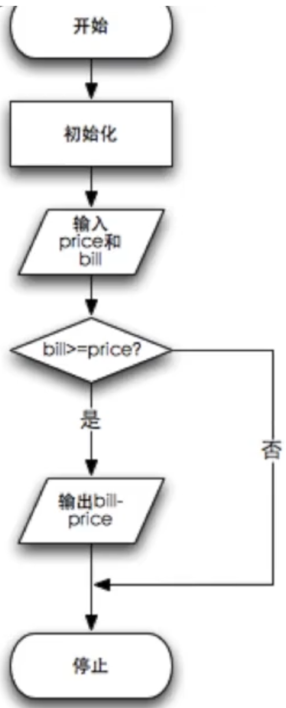
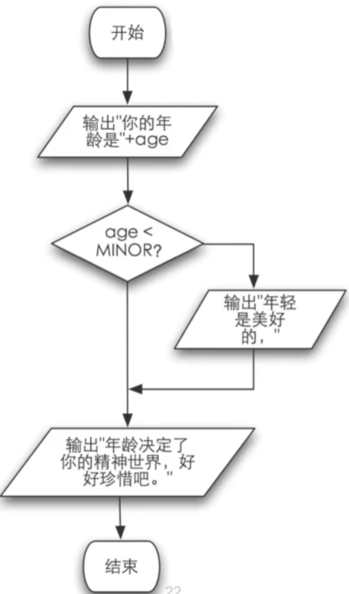
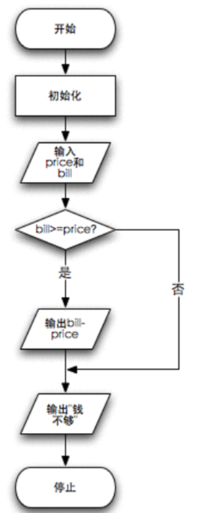
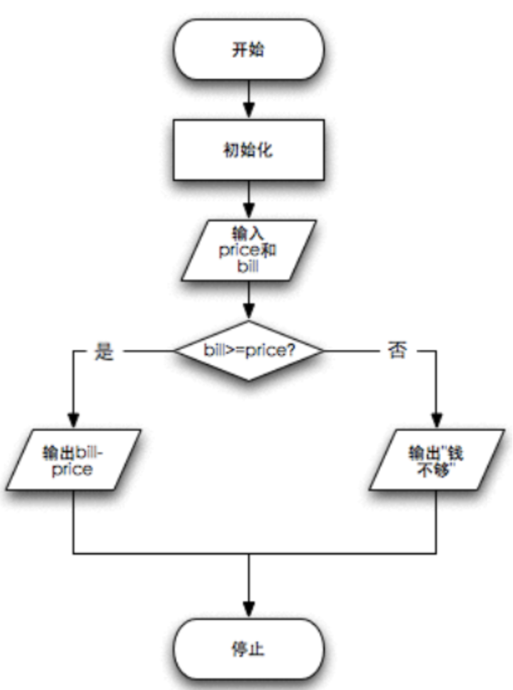
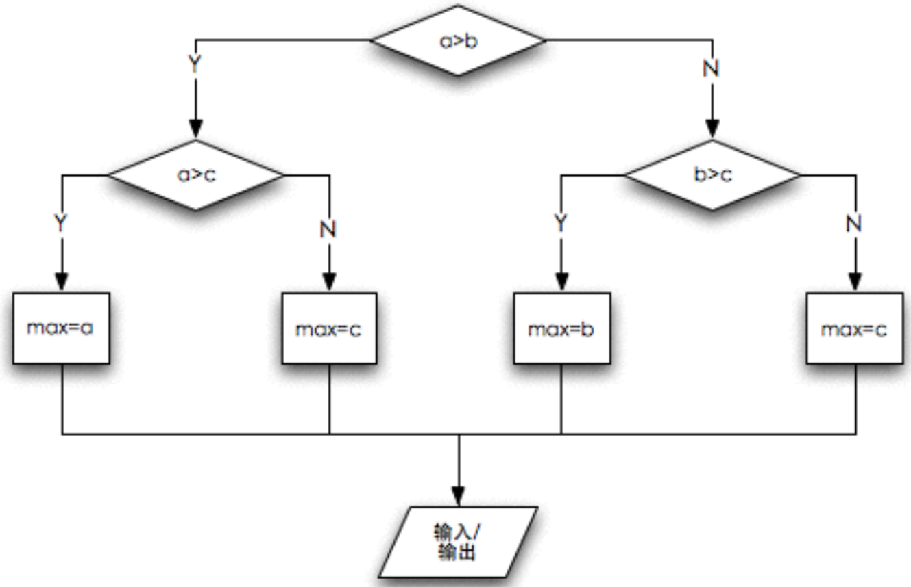
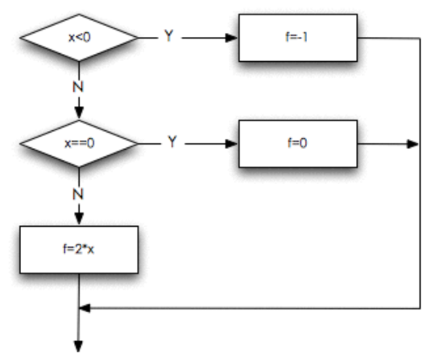

# 03.注释与控制流

[03.1注释](#031-注释)

[03.2if判断](#032-if判断)

[03.3流程图](#033-流程图)

[03.4Else](#034-else)

[03.5嵌套逻辑](#035-嵌套逻辑)

[03.6级联逻辑](#036-级联逻辑)

[03.7常见错误](#037-常见错误)

[03.8多路分支](#038-多路分支)

## 03.1 注释

在01.4中有一个练习是关于整数找零的小程序。

我们现在想做一些小的改动：找零计算器需要⽤户做两个操作：输⼊购买的⾦额，输⼊⽀付的票⾯，⽽找零计算器则根据⽤户的输⼊做出相应的动作：计算并打印找零，或告知⽤户余额不⾜以购买。

从计算机程序的⾓度看，这就是意味着程序需要读⽤户的两个输⼊，然后进⾏⼀些计算和判断，最后输出结果。

我们先写成下面这个样子，暂时忽略判断条件。

```c
#include <stdio.h>

int main(void) {
    //	初始化
    int price = 0;
    int bill = 0;
    
    //	读入金额和票面
    printf("请输入金额：");
    scanf("%d", &price);
    printf("请输入票面：");
    scanf("%d", &bill);
    
    //	计算找零
    printf("应该找您：%d\n", bill - price);
    
    return 0;
}
```

我们可以看到，程序里面有一些//开头的语句，这些是C语言的注释之一。

### 单行注释

以两个斜杠“//”开头的语句把程序分成了三个部分：

1. 初始化
2. 读入金额和票面
3. 计算找零

注意//是C99标准的注释，C89并不支持这种格式的注释。所谓注释，是插入在代码中，用来向读者提供解释信息。它们对于程序的功能没有任何影响，但是往往能使得程序更容易被人类读者所了解。

### 多行注释

//是单行注释，只能从//开始直到结束。C89支持的注释是可以存在多行的，格式如下

```c
# include <stdio.h>

int main(void) {
	/*
	*	print Hello World!
	*/
	printf("Hello World!\n");
	
	return 0;
}
```

这种延续数⾏的注释，要⽤多⾏注释的格式来写。多⾏注释由⼀对字符序列“/\*”开始， ⽽以“\*/”结束。当然，也可以只⽤于⼀⾏内的注释，例如：

```c
# include <stdio.h>

int main(void) {
	int ak = 47 /* 36 */, y = 9;
	printf("Hello World!\n");/* print Hello World! */
	
	return 0;
}
```

增加注释以后，代码明显对读者要更加友好

对于注释的格式，本课并不做特别的要求，但是要注意注释本身面对的是代码读者，而且读者阅读注释也要花费一定的时间。所以注释最好要做到简介而且扼要，针对显而易见的内容进行注释或者注释比代码还要难以理解的话还不如不要注释。

## 03.2 if判断

在02.6中，我们有一个计算时间差的问题，我们通过把时间转化为以分钟为单位来解决从而避免了借位问题导致的负数分钟。

### 如果

我们希望能做一个判断，“如果”分钟之差出现了负数，我们就对小时数和分钟数做调整。小时数减一，分钟数加六十从而解决借位问题。

因此，我们的判断条件是分钟之差是否小于0，如果小于0我们要进行特殊操作if

```c
int min_diff = minute2 - minute1;
if (min_diff < 0) {
	...
}
```

完整代码如下

```c
#include <stdio.h>

int main(void) {
	int hour1, minute1;
	int hour2, minute2;

	scanf("%d %d", &hour1, &minute1);
	scanf("%d %d", &hour2, &minute2);

	int hour_diff = hour2 - hour1;
	int min_diff = minute2 - minute1;
	if (min_diff < 0) {
		min_diff = 60 + min_diff;
		hour_diff --;
	}
	
	printf("时间差是%d小时%d分。\n", hour_diff, min_diff);
	
	return 0;
}

```

<u>***演示***</u>调试，着重看判断部分，如果分钟之差小于0，那么分钟就要加60，小时数减1，结果符合我们的预期。

if的语法是

```c
if (条件成立) {
	...
}
```

如果if括号内的条件成立，那么就执行if花括号内的操作，否则不执行。

### 关系运算符

条件有很多种方式，除了小于号，也有大于号之类的，下面是一个关系运算符的表格

| 运算符 | 意义     |
| ------ | -------- |
| ==     | 相等     |
| !=     | 不相等   |
| >      | 大于     |
| >=     | 大于等于 |
| <      | 小于     |
| <=     | 小于等于 |

==相等符号是两个等号，比较符合我们数学上等于的概念。不相等是!=，!在C语言中往往代表不或者否定的意味。

#### 关系运算的结果

当两个值的关系符合关系运算符的预期时， 关系运算的结果为整数1，否则为整数0。示例代码如下

```c
#include <stdio.h>

int main(void) {
    
    printf("%d\n", 5 == 3);
    printf("%d\n", 5 > 3);
    printf("%d\n", 5 <= 3);
    
    return 0;
}
```

实例中，只有5>3是成立的，符合预期的，所以结果是1，其余都是0。

### 关系运算符优先级

所有的关系运算符的优先级⽐算术运算的低，但是⽐赋值运算的⾼。比如：

```c
#include <stdio.h>

int main(void) {
    
    printf("%d\n", 7 >= 3 + 4);
    
    return 0;
}
```

例子中我们可以看成，首先是计算了3+4=7，然后7>=7成立所以输出结果是1。

判断是否相等的==和!＝的优先级⽐其他的低，⽽连续的关系运算是从左到右进⾏的。这样可以使我们方便的写出以下的式子。

```c
5 > 3 == 6 > 4

6 > 5 > 4

a == b == 6

a == b > 0
```

大家可以分别运行这些式子看看结果多少，是否符合你的预期。

## 03.3 流程图

我们在03.1中的程序中忽略了判断，现在我们把整个程序完善一下判断条件如下

```c
#include <stdio.h>

int main(void) {
    //	初始化
    int price = 0;
    int bill = 0;
    
    //	读入金额和票面
    printf("请输入金额：");
    scanf("%d", &price);
    printf("请输入票面：");
    scanf("%d", &bill);
    
    //	计算找零
    if (bill >= price) {
        printf("应该找您：%d\n", bill - price);
    }
    
    return 0;
}
```

有时候，在写代码之前，我们可以通过流程图检验代码判断是否合理，我们对于这个程序可以画出如下的流程图



圆角的方框表示开始或者结束，方角的方框表示操作，平行四边形表示输入和输出，菱形表示判断。

关键看bill>=price?这个菱形判断框，如果是的话，说明我们票面足够，输出；否则，我们跳过直接结束程序。

通过使用这种流程图，我们能够更加轻松地把握复杂逻辑。

我们来看下面一个例子

```c
#include <stdio.h>

int main(void) {

	const int MINOR = 35;

	int age = 0;

	printf("请输入你的年龄: ");
	scanf("%d", &age);

	printf("你的年龄是%d岁。\n", age);

	if ( age < MINOR ) {
    	printf("年轻是美好的，");
	}

	printf("年龄决定了你的精神世界，好好珍惜吧。\n");

	return 0;
}
```

<u>***演示***</u>，流程图如下



我们可以看到，程序的表现结果和流程图是一致的。在简单的判断条件下，流程图没有太大的需要。但是以后我们接触到比较复杂和大型的代码时，流程图就会体现出它的作用。

## 03.4 Else

针对03.3的找零程序，我们想继续深化一步，假如说票面不够的时候怎么办？

首先，我们尝试在if后面加语句，代码如下

```c
#include <stdio.h>

int main(void) {
    //	初始化
    int price = 0;
    int bill = 0;
    
    //	读入金额和票面
    printf("请输入金额：");
    scanf("%d", &price);
    printf("请输入票面：");
    scanf("%d", &bill);
    
    //	计算找零
    if (bill >= price) {
        printf("应该找您：%d\n", bill - price);
    }
    printf("你的钱不够\n");
    return 0;
}
```

如果在if后⾯还有语句，它们在if结束后会执⾏，⽆论条件如何。

这个程序的流程图如下



我们发现，如果只是放在if条件后面，那么这句话总是会执行，不符合我们的预期。我们希望当if的条件不成立时，做另外的事情，我们希望有一个否则机制。而这个机制就叫else。

我们把else加在if语句后面尝试

```c
#include <stdio.h>

int main(void) {
    
	//	初始化
	int price = 0;
	int bill = 0;
    
	//	读入金额和票面
	printf("请输入金额：");
	scanf("%d", &price);
	printf("请输入票面：");
	scanf("%d", &bill);
    
	//	计算找零
	if ( bill >= price ) {
		printf("应该找您：%d\n", bill - price);
	} else {
		printf("你的钱不够\n");
	}

	return 0;
}
```

后面这部分的意思是

当bill大于等于price时输出应该找您：xxx

而bill小于price时输出你的钱不够

现在流程图是这个样子



在图中我们可以看到，bill>=price?这个判断的是会走向一边，否会走向另一边。两边没有重合的部分，符合我们对于程序的预期。

<u>***演示***</u>对比一下输出结果

对于金额和票面的不同组合，程序有不一样的输出。这符合我们的预期，证明了我们流程图的正确性。

### 比较两个数的大小

我们再来看另外一个例子，比较两个整数的大小

```c
#include <stdio.h>

int main(void) {
	int a, b;

	printf("请输入两个整数：");
	scanf("%d %d", &a, &b);
	
	int max = 0;
	if ( a > b ) {
		max = a;
	}

	printf("大的那个是%d\n", max);

	return 0;
}
```

这个程序有一个小问题，当b>=a时，它无法产生正确的输出，max依然会是0。

要解决这个问题，我们可以很快得到三种解决方案。

方案一

```c
#include <stdio.h>

int main(void) {
	int a, b;

	printf("请输入两个整数：");
	scanf("%d %d", &a, &b);
	
	int max = 0;
	if ( a > b ) {
		max = a;
	}
    if ( b >= a ) {
		max = b;
	}

	printf("大的那个是%d\n", max);

	return 0;
}
```

我们可以做两次if判断来判断a和b的大小关系，这是一种思路。但是其实a和b的大小关系基本是个非此即彼的互斥关系，因此我们可以采用else代替第二个if产生方案二。

```c
#include <stdio.h>

int main(void) {
	int a, b;

	printf("请输入两个整数：");
	scanf("%d %d", &a, &b);
	
	int max = 0;
	if ( a > b ) {
		max = a;
	} else {
		max = b;
	}

	printf("大的那个是%d\n", max);

	return 0;
}
```

这个已经是一个比较好的思路，但是我们可以继续深入地思考。既然a和b的最大值只会是其中之一的话，我们可以将max的值初始化为其中的一个，这样只需要一次if比较即可。我们可以由此得到方案三。

```c
#include <stdio.h>

int main(void) {
	int a, b;

	printf("请输入两个整数：");
	scanf("%d %d", &a, &b);
	
	int max = b;
	if ( a > b ) {
		max = a;
	}

	printf("大的那个是%d\n", max);

	return 0;
}
```

在这段程序中，max已经被初始化为b的值。假如a比b大，那么将a的值赋给max即可。否则不需要做任何改变。这种方案较为巧妙，但和其他的方案比，没有那么直接易懂。

同学们觉得方案二和方案三孰优孰劣呢？比较的标准很大，看待问题的角度不一样，大家心中的答案也许不同。从某种程度上来说，我比较欣赏方案二。因为方案二够“傻”，够直观，是大家普遍容易接受的答案。而方案三看起来比较“酷炫”，需要一定的理解能力才能明白。

写代码，有时候“酷炫”或者效率并不是我们追求的唯一目的。代码能具有更强的普适性，更多人能够读懂你的代码，这也是非常重要的一点。

### 回到if语句

一个基本的if语句由一个关键字if开头，跟上在圆括号里的一个表示条件的逻辑表达式，然后是一对大括号“{}”之间的若干条语句。如果表示条件的逻辑表达式的结果不是零，那么就执行后面跟着的这对大括号中的语句，否则就跳过这些语句不执行，而继续下面的其他语句。

但是我们也可以选择不写花括号，那么接下来紧跟的一句就会是if条件成立时要执行的语句，比如

```c
#include <stdio.h>

int main(void) {
	
    if (1)
        printf("Hello World!\n");

	return 0;
}
```

if语句这⼀⾏结束的时候并没有表⽰语句结束的“;”，⽽后⾯的语句写在if的下⼀⾏，并且缩进了，在这⼀⾏结束的时候有⼀个表⽰语句结束的“;”。这表明这条语句是if语句的⼀部分，if语句拥有和控制这条赋值语句，决定它是否要被执⾏。else也是同样的道理。***没有大括号的时候，只有紧跟的下一句是会在if/else的作用范围内。***

### 小练习

#### 计算薪水

接下来，我们要写一个计算薪水的小程序，让用户输入工作的小时数，计算用户的报酬。普通时薪是8.25，标准工作时间是40小时，超时时薪是普通时薪的1.5倍。那么数学公式是
$$
如果超时，薪水 = 标准工作时间 * 普通时薪 + (工作时间 - 标准工作时间) * (普通时薪 * 1.5)
$$

$$
否则，薪水 = 工作时间 * 普通时薪
$$

代码如下

```c
#include <stdio.h>

int main(void) {
	const double RATE = 8.25;  
	const int STANDARD = 40;   
	double pay = 0.0;
	int hours;

	printf("请输入工作的小时数: ");
	scanf("%d", &hours);
	printf("\n");
	if (hours > STANDARD)
   		pay = STANDARD * RATE + 
   			(hours-STANDARD) * (RATE * 1.5);
	else
   		pay = hours * RATE;
	printf("应付工资: %f\n", pay);

	return 0;
}
```

程序中有一些常数，rate表示时薪，STANDARD表示一周标准工作时间。如果用户输入的工作时间小于标准工作时间，那么薪水就是工作时间*时薪，否则还要加上加班工资。记住最后一个printf虽然在if/else的后面，但是和if/else并没有关系，它是另外的一条语句。无论是if成立还是else成立，程序都会执行最后一个printf。

#### 判断成绩

同样的道理，我们再写一个程序来判断成绩是否及格。如果成绩大于60分则及格，否则不及格。

代码如下

```c
#include <stdio.h>

int main(void) {
	const int PASS=60;
	int score;

	printf("请输入成绩: ");
	scanf("%d", &score);
	printf("你输入的成绩是%d.\n", score);
    
	if ( score < PASS )
		printf("很遗憾，这个成绩没有及格。");
	else 
		printf("祝贺你，这个成绩及格了。");
	printf("再见\n");
    
	return 0;
}
```

常量PASS代表及格分数，score是要求用户输入的数据。我们在scanf后再加一个printf用以检验用户的输入，我们常常用这种方法来检测用户是否按要求进行输入。注意if/else都没有大括号，所以最后一个printf永远会执行。

但我们可以稍作修改，得到下方的程序，大家可以尝试运行调试看看这两个程序的表现有何不同。希望大家能通过这两个程序的对比了解到{}的意义和作用。

```c
#include <stdio.h>

int main(void) {
	const int PASS=60;
	int score;

	printf("请输入成绩: ");
	scanf("%d", &score);
	printf("你输入的成绩是%d.\n", score);
    
	if ( score < PASS )
		printf("很遗憾，这个成绩没有及格。");
	else {
        printf("祝贺你，这个成绩及格了。");
		printf("再见\n");
    }
    
	return 0;
}
```

## 03.5 嵌套逻辑

在03.4中，我们写了程序来比较a、b两个整数的大小。现在，假如我们要比较a、b、c三个整数的大小又应该怎么办呢？

首先，我们可以进行多次比较。先比较a和b的大小，把较大的数再来和c相比。这样我们就完成了基本的逻辑嵌套。

```c
#include <stdio.h>

int main(void) {
	int a,b,c;
	scanf("%d %d %d", &a, &b, &c);

	int max = 0;

	if (a > b) {
		if (a > c) {
			max = a;
		} else {
			max = c;
		}
	} else {
		if (b > c) {
			max = b;
		} else {
			max = c;
		}
	}

	printf("The max is %d\n", max);

	return 0;
}
```

当然，我们可以把里面的if/else的花括号去掉，因为他们分别都只有一个操作。

程序的流程图如下



### 嵌套的判断

当if的条件满⾜或者不满⾜的时候要执⾏的语句也可以是⼀条if或if-else语句，这就是嵌套的if语句。

```c
if (code == READY)
    if (count < 20)
        printf("一切正常\n");
	else
        printf("继续等待\n");
```

上面的代码就是一个嵌套if的例子。

当然，大家注意到这里有两个if，那么else匹配的是哪个if呢？

### else的匹配

先说结论：else总是和最近的那个if匹配。因此在上面的例子中，else匹配的是if(count < 20)

```c
if (code == READY) {
	if (count < 20)
        printf("一切正常\n");
}	else
        printf("继续等待\n");
```

倘若把代码改成这个样子，由于花括号里的if成为了外面的if的内容。那么else匹配的最近的if其实是if(code == READY)。当然，希望同学们可以亲自进行尝试来增强理解。可以对if/else进行修改来查看else的匹配从而了解匹配的方式。

### 缩进

值得注意的是，和有些语言（例如Python）不一样。缩进在C语言里只是让代码美化并没有实际意义，因此无法通过改变缩进来改变else的匹配。换言之，缩进格式不能暗⽰else的匹配。

```c
if (code == READY)
    if (count < 20)
        printf("一切正常\n");
else
	printf("继续等待\n");
```

这段代码尽管else和if(code == READY)对齐了，但它依然匹配的是第二个if(count < 20)。大家可以自己尝试运行看看结果如何。

### 小练习

下面给出几个if/else的代码片段，大家可以通过逻辑推理和实际运行来得到背后的判断分支。

```c
if (gameover == 0)
	if (player2move == 2)
        printf("Your turn\n");
```

```c
if (gameover == 0)
	if (player2move == 2)
        printf("Your turn\n");
	else
        print("My turn\n");
```

```c
if (gameover == 0)
	if (player2move == 2)
        printf("Your turn\n");
	else
        print("My turn\n");
else
    printf("GAME OVER\n");
```

```c
if (gameover == 0)
	if (player2move == 2)
        printf("Your turn\n");
else
    printf("GAME OVER\n");
```

```c
if (gameover == 0) {
    if (player2move == 2)
        printf("Your turn\n");
} else
    printf("GAME OVER\n");
```

这5个例子大家可以好好分析，但是这5个例子其实重点并不在于让大家进行判断。而是让大家在判断的过程中发现，这几种写法使人阅读起来比较麻烦，理解难度较大。

因此我想给大家的建议是，

***在if或else后⾯总是⽤{}，即使只有⼀条语句的时候。***

这是一种良好的编程习惯，尤其是现代的IDE或者编辑器都会自动补全或者提示花括号。这样有助于他人理解你的代码，甚至在你阅读你以前写的代码的时候也会更加的方便。

## 03.6 级联逻辑

假设我们要实现以下的分段函数
$$
x<0,f(x)=-1;x=0,f(x)=0;x>0,f(x)=2x;
$$
代码如下

```c
if (x < 0) {
    f = -1;
} else if (x == 0) {
    f = 0;
} else {
    f = 2 * x;
}
```

流程图如下



这种关系，构成了一种级联的if/else，基本语法如下

```c
if (exp1)
    st1;
else if (exp2)
    st2;
else
    st3;
```

其中，else if可以有多个，当if和全部else if无法满足时，else才会执行。

### 为什么需要级联

因为级联可以取代一些嵌套逻辑，减少缩进，塑造更好的代码格式，使得代码看起来更加清晰易懂。由于电脑屏幕尺寸的限制，过多的缩进不方便进行代码浏览。

 比如以下级联代码

```c
#include <stdio.h>

int main(void) {
	int x;

	scanf("%d", &x);

	int f=0;
	if ( x < 0 ) {
		f = -1;
	} else if ( x == 0 ) {
		f = 0;
	} else if ( x >5 ) {
		f = 2 * x;
	} else {
		f = 3*x;
	}

	printf("%d\n", f);

	return 0;
}
```

如果改成嵌套，那么就会变成

```c
#include <stdio.h>

int main(void) {
	int x;

	scanf("%d", &x);

	int f=0;
	if ( x < 0 ) {
		f = -1;
	} else {
        if (x == 0) {
            f = 0;
        } else {
            if (x > 5) {
                f = 2 * x;
            } else {
                f = 3 * x;
            }
        }
    } 

	printf("%d\n", f);

	return 0;
}
```

相对而言，这个程序逻辑已经比较简单，但是缩进依然比较多。如果以后有更加复杂的级联关系的话缩进就会更多，使得浏览没有那么方便。

### 级联代码规范

比较下面两段代码

```c
if (x < 0) {
    f = -1;
} else if (x == 0) {
    f = 0;
} else {
    f = 2 * x;
}
printf("%d", f);
```

```c
if (x < 0) {
    printf("-1");
} else if (x == 0) {
    printf("0");
} else {
    printf("%d", 2 * x);
}
```

虽然输出的结果都是一样，但是我个人推荐左边的代码范式。因为它是单一出口的，可以理解成它对于数据的改变没有影响操作。而右边类似于硬编码的行为绑定了数据和操作，造成了多个出口。所谓出口，不一定指的是离开代码的代码，像输出结果给控制台/用户也是一种出口。

抽象来说，数据可以看成数据结构，而操作可以看成是算法。二者之间可以绑定可以分离，没有绝对的规定。但是我个人比较欣赏二者分离的处理方式，这会让代码更加易懂。

## 03.7 常见错误

下面我们探究几个if语句常⻅的错误

1. 忘了大括号
2. if后面加了;
3. 错误使用==和=
4. 使人困惑的else

### 忘了大括号

先来个下面的例子

```c
if (age > 60)
    salary = salary * 1.2;
	printf("%f", salary);
```

缩进上给人的错觉是printf也属于if的一部分，实际上并不是。解决这种问题，我们可以进行如下修改

```c
if (age > 60) {
    salary = salary * 1.2;
	printf("%f", salary);
}
```

这种错误往往是由于小疏漏导致的，所以解决方法也很简单，规定我们的代码编程范式即可。***永远在if和else后⾯加上⼤括号，即使当时后⾯只有⼀条语句。***

### if后面加;

再来个例子

```c
if (age > 60);
{
    salary = salary * 1.2;
	printf("%f", salary);
}
```

if后多个了分号。从编译器的角度来看，它会觉得代码其实是这个样子

```c
if (age > 60)
    ;
{
    salary = salary * 1.2;
	printf("%f", salary);
}
```

<u>***演示***</u>调试

也就是说，if语句其实并没有进行任何操作。而下面的几行已经和if判断没有关系，所以并不受if条件约束。

注意，这两个花括号就是代表普通语句，大家可以在自己的代码中尝试一下。

这个是很多初学者会犯的错，只要代码写完后检查一下;即可。

### 错误使用==和=

这个应该是最常见的错误，由于数学上的关系，我们总是在潜意识中觉得=仍旧代表逻辑判断等于。但在C语言中，它只有赋值的含义，而==才能进行等于判断。

要记住，if只要求()⾥的值是零或⾮零

```c
if (a = b) {
    printf("A=B");
}
```

像上面这段代码，大家可以尝一下针对不同的a和b的值会有什么区别，再把=改成==试一下。

有的时候，编译器会针对if中的=进行警告但不会报错，所以上面的代码是可以正常编译运行的。但是同学们对于警告不要忽略，有时候这些不起眼的小问题就会出现在警告中。

### 代码风格

这里我想再强调一下代码风格的问题，因为初学者掌握了一种代码风格后基本很难改变。我想提出两个建议

1. 在if和else之后必须加上⼤括号形成语句块；
2. ⼤括号内的语句缩进⼀个tab的位置；

除了这些以外，有的风格是并没有限制的，也对代码的阅读理解没有障碍。这种时候大家选择自己喜欢的风格即可。但不要同时选用多种风格，这会让代码看起来比较混乱。以下三种格式是比较常见的

```c
if (x < 0) {
    f = -1;
} else if (x == 0) {
    f = 0;
} else {
    f = 2 * x;
}
```

```c
if (x < 0) 
{
    f = -1;
} else if (x == 0) 
{
    f = 0;
} else 
{
    f = 2 * x;
}
```

```c
if (x < 0) 
{
    f = -1;
} 
else if (x == 0) 
{
    f = 0;
} 
else 
{
    f = 2 * x;
}
```

这些风格都是可取的，而且都没有违反我说的建议。大家自行选择一种养成习惯即可。如果大家以后会进入计算机行业工作，那么一般来说公司都会有自己的代码风格和规范，到时再进行微调即可。

## 03.8 多路分支

我们在03.6中学习到了级联逻辑，但是在实践中我们有时候会遇到这种情况：在一些点上，当变量等于某个值的时候做一种操作，等于另外一个值的时候又进行其他操作。比如以下代码

```c
if (type == 1)
    printf("你好");
else if (type == 2)
    printf("早上好");
else if (type == 3)
    printf("晚上好");
else if (type == 4)
    printf("再见");
else
    printf("啊，什么啊？");
```

<u>***演示***</u>调试，我们会发现假如type是4，那么这个代码总共会做4次判断，包括一个if和3个else if。有时候极端情况下会进行所有判断到最后一个else去，我们有一种方法可以去掉这种冗余判断。

```c
switch (type) {
    case 1:
        printf("你好");
        break;
    case 2:
        printf("早上好");
        break;
    case 3:
        printf("晚上好");
        break;
    case 4:
        printf("再见");
        break;
    default:
        printf("啊，什么啊？");
}
```

像上图一样，我们可以采用switch case来进行判断。switch起到了开关的作用，type这个圆括号内的部分表示输入，这个开关会根据输入来选择合适的case进行操作。

假如type是1，那么switch会从case1开始运行直到遇到break为止。类似地，假如type是3，那么switch会从case3开始运行直到遇到break为止。假如type的值不属于1，2，3，4中的任何一个，这种属于默认或者其他情况，那么switch就会从default开始运行。因为default一般都是放在switch的底部，所以不需要break。

switch的语法如下

```c
switch (控制表达式) {
    case 常量:
        语句
        ......
    case 常量:
        语句
        ......
    default:
        语句
        ......
}
```

首先，圆括号内是控制表达式。然后switch里面一般由若干case和一个default组成。case后是一个常量然后接一个冒号:。最后是一个default，所以不符合所有case的就会在default中执行。

我们要注意的几点是

1. 控制表达式只能是整数型的结果
2. 常量可以是常数，也可以是常数计算的表达式
3. 根据表达式的结果，寻找匹配的case，并执⾏case后⾯的语句，⼀直到break为⽌
4. 如果所有的case都不匹配，那么就执⾏default后⾯的语句；如果没有default，那么就什么都不做

大家可以尝试把控制表达式改成double，把case后面接着的常数改为计算表达式等等看看结果如何。

另外，常量那个部分在C99标准中可以使用const int，但是C89由于没有const所以不支持这种操作。

看完这些代码后，大家可能认为case之间是已分隔的形式，其实并非如此。

switch语句可以看作是⼀种基于计算的跳转，计算控制表达式的值后，程序会跳转到相匹配的case（分⽀标号）处。分⽀标号只是说明switch内部位置的路标，在执⾏完分⽀中的最后⼀条语句后，如果后⾯没有break，就会顺序执⾏到下⾯的case⾥去，直到遇到⼀个break，或者switch结束为⽌。

例如以下代码

```c
switch (type) {
    case 1:
    case 2:
        printf("你好");
        break;
    case 3:
        printf("晚上好");
    case 4:
        printf("再见");
        break;
    default:
        printf("啊，什么啊？");
}
```

大家可以尝试如果type是1和3的时候会有什么样的输出。

下面是两个小练习，大家可以回去自己编写调试看看是否能得到正确答案。如果能用switch正确写出来，那么基本上就掌握了switch的使用方法，另外可以尝试把switch修改成if else来复习一下级联或者嵌套逻辑。

### 小练习

1. 将一个百分制成绩转换为五分制成绩。转换规则：大于等于90分为A；小于90且大于等于80为B；小于80且大于等于70为C；小于70且大于等于60为D；小于60为E。
2. 输入数字1-12，输出该数字代表的月份的英文单词。

大家先自己尝试写，参考代码可以查看[练习1](./C3/grade.c)，[练习2](./C3/month.c)

因为我们暂时还没有学习到字符串的处理，所以同学们暂时不需要写出程序的单一出口表达。后面我们学习到字符串的时候可以对代码进行优化。我们以后也有其他更好的方法来优化这些程序。

大家也可以再思考一下，对于03.6出现的分段函数，我们是否可以使用switch case来做呢？欢迎大家积极讨论。