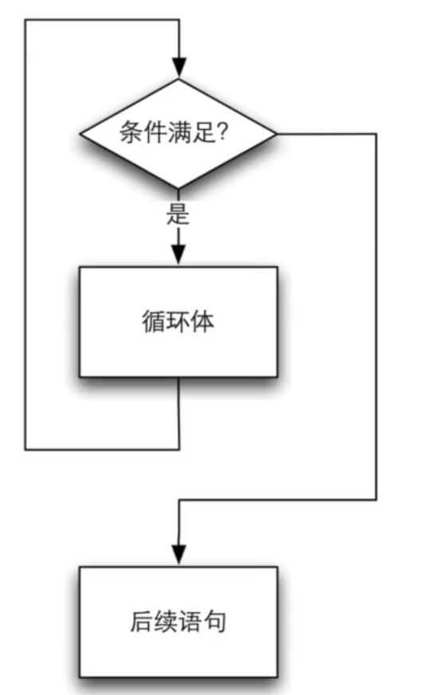
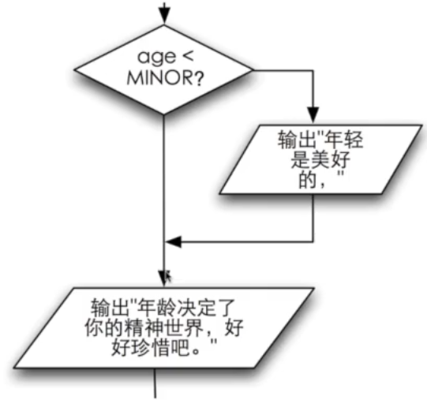
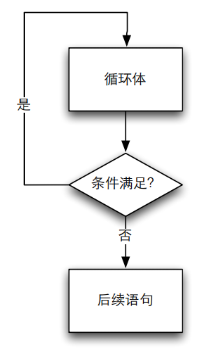
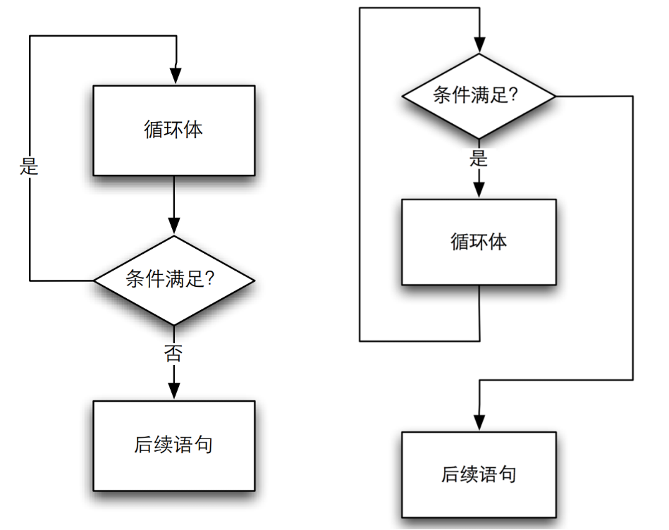

# 04.循环

[04.1循环初探](#041-循环初探)

[04.2while循环](#042-while循环)

[04.3do-while循环](#043-do-while循环)

[04.4第四章练习](#04.4-第四章练习)

## 04.1 循环初探

现在有这么一个题目

程序要读⼊⼀个4位以下（含4位）的正整数，然后输出这个整数的位数。如：输⼊：352，输出：3

### 人vs计算机

从身体构造上来说，人和计算机就不太一样。因此我们对于问题的处理方式，往往也和计算机不一样，就从这个问题来说。

从人的角度来看，我们眼睛⼀看就知道了，352->3位数，得到结果。

但是眼睛一看这并不属于计算机的操作方式。所以计算机采取的⽅式是判断数的范围来决定它的位数。在它看来，352∈[100,999] -> 3位数。

这种思维方式，并不属于一般人的常规思维方式。因为普遍而言，⼈对数字的计算能⼒⽐⽂字弱。

但是按照这个思路，我们可以写出一种可行的程序

```c
int x;
int n = 1;
scanf("%d", &x);

if (x > 999) {
    n = 4;
} else if (x > 99) {
    n = 3;
} else if (x > 9) {
    n = 2;
}

printf("%d\n", n);
```

我们能写出这个程序，因为这个题目有限制：明确了4位数及以下的正整数，所以可以简化⼀些判断。

注意一下，如果大家把上面的else if换成if会有什么后果？

大家要记得，C程序可以看成是一个一个步骤组成的，这些条件语句不代表数学说明或者关系，都是一个个步骤。

因为整个程序是从⾼处往下判断，所以不需要判断上限了，但是反之则不行（或者说不切实际）。

那么现在问题来了，假如输入任意范围的正整数怎么办？

当然，我们可以不断地扩写if/else，但是这样一来会使代码非常臃肿，二来很难发现其中的逻辑。这个时候我们发现可能要换一个思路。

### 换个思路

既然在人类的角度上，判断352->3位数很快，那么我们人是怎么判123812843267518273618273612675317⼏位数？显然，我相信很少人能够一眼看出是几位数，那么人是怎么解决的呢？

答案也很简单，数数！

⼈怎么数？从左往右数，⼀次划掉⼀个数字，那么计算机怎么执行划掉数字的操作呢？

如果大家做过三位数逆序的题的话，我们以352为例
$$
352\%100->52
$$

$$
52\%10->2
$$

$$
...
$$

那么，同理可得，
$$
123812843267518273618273612675317\%100000000000000000000000000000000->23812843267518273618273612675317
$$
那么问题来了，我们怎么得到那个100000000000000000000000000000000？

目前看来好像还是没有什么好的方法，但是我们再换一种思路，假如我们从右往左划呢？
$$
123812843267518273618273612675317/10->12381284326751827361827361267531
$$
我们每次可以划掉最右边的数，然后一直划，直到没数可以划（剩余的部分是0），在这个过程中计数，我们就可以得到位数。

```c
int x;
int n = 0;

scanf("%d", &x);

n++;
x /= 10;
if (x > 0) {
    n++;
    x /= 10;
    if (x > 10) {
        n++;
        x /= 10;
        if ...
    }
}

printf("%d\n", n);
```

我们发现，如果用if不断嵌套的话，这个问题还是没完没了。因为我们不知道究竟要嵌套几层才能做完全部操作。所以我们也许需要循环帮助我们工作：

```c
int x;
int n = 0;

scanf("%d", &x);

n++;
x /= 10;
while (x > 0) {
    n++;
    x /= 10;
}

printf("%d\n", n);
```

同学们可以自己在电脑上运行调试一下看看是否符合我们的预期。当然，请不要直接用123812843267518273618273612675317来作为输入，在数学中数的大小是没有限制的，但是在计算机中由于数据储存在内存中所以大小是有限的，具体我们后面会具体讲述。但是我们可以用例如999999之类的作为输入来验证结果。

## 04.2 while循环

从04.1的例子我们可以看到，单纯从语法角度而言while循环非常简单。

我们先类比下面这个if判断

```c
if (x > 0) {
    x /= 10;
    n++;
}
```

这个if语句判断x是否大于0，如果是的话x除以10，n加1。那么，我们只要将if关键词换成while，这个判断语句就成了循环了，如下

```c
while (x > 0) {
    x /= 10;
    n++;
}
```

while同样需要圆括号里面的判断表达式和花括号内的执行语句。和if不同的是if只执行一次，而while会不断地执行直到判断表达式为0为止。二者只有执行次数的区别。

我们可以画出while的流程图如下：



我们先判断条件是否满足，如果满足就执行循环体（花括号以内的内容），循环体执行结束后回去继续进行条件判断。当然，如果条件判断不满足的话就离开循环体执行后续语句。

再对比一下以前我们的一个if流程图



if条件满足，做一些操作然后离开了，不满足的话就直接离开。所以if和while的区别只是做判断和操作一次性还是反复多次。

循环体内要有改变条件的机会，否则这个循环会无法跳出，导致我们通常所说的“死循环”。

在上面的while循环中，如果我们把x /= 10;这一句删掉，大家可以用IDE调试一下看看会是什么结果。

注意，死循环的写法属于逻辑错误而非编译语法错误。所以编译器一般而言是不会报错乃至警告的，这种时候通常需要自己进行判断调试来找出问题所在。所以不能认为程序通过编译了就代表程序是正确的。一般而言，有的操作系统或者一些网上题库会出现超时警告来提醒死循环。

如果我们把while翻译作“当”，那么⼀个 while循环的意思就是：当条件满⾜时，不断地重复循环体内的语句。

循环执⾏之前判断是否继续循环，所以有可能循环⼀次也没有被执⾏；

条件成⽴是循环继续的条件。

回想04.1的代码

```c
int x;
int n = 0;

scanf("%d", &x);

n++;
x /= 10;
while (x > 0) {
    n++;
    x /= 10;
}

printf("%d\n", n);
```

n++;和x/=10;出现了两次，我们是不是能把这两处合并成一处呢？我们尝试合并如下

```c
int x;
int n = 0;

scanf("%d", &x);

while (x > 0) {
    n++;
    x /= 10;
}

printf("%d\n", n);
```

合并后，程序就成了这个样子。外面就不需要进行一次额外的操作了。为了验证我们程序的正确性，我们有时可以用⼈脑模拟计算机的运⾏，在纸上列出所有的变量，随着程序的进展不断重新计算变量的值。当程序运⾏结束时，留在表格最下⾯的就是程序的最终结果。

<u>***演示***</u>运算

我们列出每次循环的结果，然后逐一比对看看是否符合预期。

当然，仅仅测试352是不够的，我们进行测试和验证，测试程序常使⽤边界数据，如有效范围两端的数据、特殊的倍数等。

比方说，我们可以测试个位数、10、0乃至负数。大家可以自行测试看看运行结果如何。

除了把测试结果手写出来或者手打在电脑中。我们可以在程序适当的地⽅插⼊printf来输出变量的内容。如下

```c
int x;
int n = 0;

scanf("%d", &x);

while (x > 0) {
    printf("x=%d, n=%d\n", x, n);
    n++;
    x /= 10;
}

printf("%d\n", n);
```

这样每次循环我们都能检查变量的数值，检查程序是否符合我们的要求。printf并不需要每次都检查变量，有时候我们只是检查程序是否进入循环或者判断让printf打印一些字符串也是可以的。因此，即使不需要启动debug调试我们也可以知道程序的运行情况，printf也是一种我们常用的调试手段。

当然，不需要调试的时候我们可以把调试用的printf打上注释以免干扰。

## 04.3 do-while循环

4.2中，我们把级联嵌套的if语句改成了while循环，但是我们还没有深究它的算法。其实它的算法可以描述成以下步骤

1. 用户输入x
2. 初始化n为0
3. x=x/10，去掉各位
4. n++
5. 如果x>0，回到第3步
6. 否则n就是结果

在算法中，我们要求先做3、4步然后才判断是否大于0，所以我们要在循环的外面先做一遍操作然后再进入循环。那么我们有没有什么结构来更好的表达这种算法，这样我们就不需要在循环体外再额外写一些代码呢？换言之，我们希望先操作，然后再进入循环。

### do-while循环

在进⼊循环的时候不做检查，⽽是在执⾏完⼀轮循环体的代码之后，再来检查循环的条件是否满⾜，如果满⾜则继续下⼀轮循环，不满⾜则结束循环。语法如下

```c
do {
	循环体语句
} while(循环条件);
```

流程图如下



注意while条件判断的最后要有一个;否则语句没有结束。

while和do-while的流程图对比



do-while循环和while循环很像，区别是在循环体执⾏结束的时候才来判断条件。也就是说，⽆论如何，循环都会执⾏⾄少⼀遍，然后再来判断条件。与while循环相同的是，条件满⾜时执⾏循环，条件不满⾜时结束循环。

我们把代码改写成do-while循环如下

```c
int x;
int n = 0;

scanf("%d", &x);

do {
    n++;
    x /= 10;
} while (x > 0);

printf("%d\n", n);
```

大家一定要注意do-while最后的分号;大家可以自行运行调试代码看看和while循环的差别在哪里。

## 04.4 第四章练习

1. 取以2为底的对数
   1. 结果要输出原来的输入还有对数的值
2. 计数循环
   1. 循环执行次数
   2. \>=、<=、\>、<
   3. 模拟运⾏⼀个很⼤次数的循环，可以模拟较少的循环次数，然后作出推断
3. 猜数游戏
   1. 让计算机来想⼀个数，然后让⽤户来猜，⽤户每输⼊⼀个数，就告诉它是⼤了还是⼩了，直到⽤户猜中为⽌，最后还要告诉⽤户它猜了多少次。
   2. 要使用到rand()函数和srand()函数。因为使用了这两个函数，所以要多添加两个库<stdlib.h>和<time.h>。我们现在只需要知道这两个函数的结合可以让我们产生随机数即可。
   3. 思考rand()函数为什么要对100取余
   4. 如果使用高效的猜法，应该可以在7次之内得到答案，大家可以思考一下用什么方法可以高效解决这个问题。
4. 求平均数
   1. 我们让⽤户输⼊⼀系列的正整数，最后输⼊-1表⽰输⼊结束，然后程序计算出这些数字的平均数，输出输⼊的数字的个数和平均数。
   2. 分别用while和do-while来实现
5. 整数位数之和
   1. ⼀个非负整数是由1⾄多位数字组成的，如何分解出整数的各个位上的数字，然后求和
6. 数的逆序
   1. 输⼊⼀个正整数，输出逆序的数。特别注意0的处理。

注意，编程的时候我们要着重研究问题本身，算法是为问题服务的。