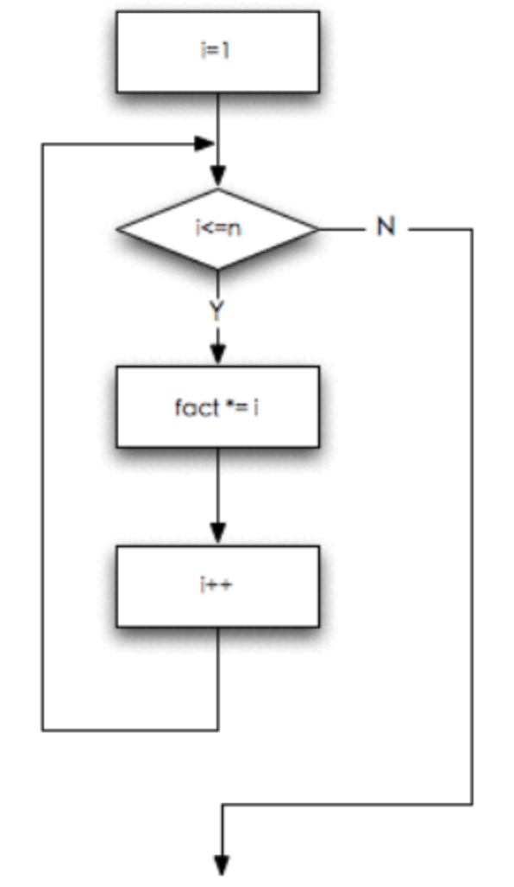
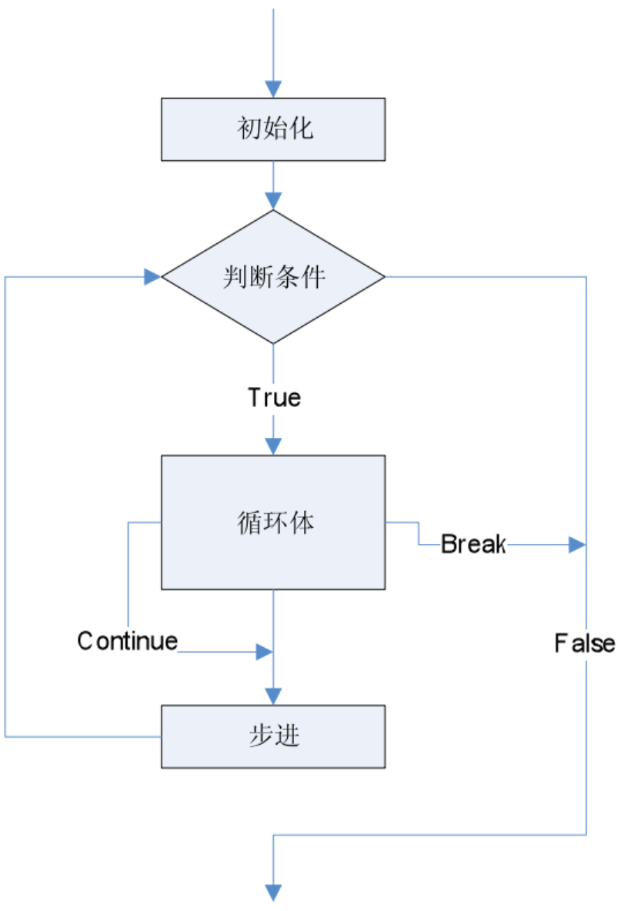

# 05.循环控制和应用

- [05.循环控制和应用](#05%e5%be%aa%e7%8e%af%e6%8e%a7%e5%88%b6%e5%92%8c%e5%ba%94%e7%94%a8)
	- [05.1 for循环](#051-for%e5%be%aa%e7%8e%af)
		- [循环次数](#%e5%be%aa%e7%8e%af%e6%ac%a1%e6%95%b0)
		- [循环等价](#%e5%be%aa%e7%8e%af%e7%ad%89%e4%bb%b7)
	- [05.2 循环的控制和嵌套](#052-%e5%be%aa%e7%8e%af%e7%9a%84%e6%8e%a7%e5%88%b6%e5%92%8c%e5%b5%8c%e5%a5%97)
		- [循环控制](#%e5%be%aa%e7%8e%af%e6%8e%a7%e5%88%b6)
		- [break vs continue](#break-vs-continue)
		- [循环嵌套](#%e5%be%aa%e7%8e%af%e5%b5%8c%e5%a5%97)
			- [找100以内的素数](#%e6%89%be100%e4%bb%a5%e5%86%85%e7%9a%84%e7%b4%a0%e6%95%b0)
			- [凑硬币](#%e5%87%91%e7%a1%ac%e5%b8%81)
	- [05.3 第五章练习](#053-%e7%ac%ac%e4%ba%94%e7%ab%a0%e7%bb%83%e4%b9%a0)

## 05.1 for循环

上一章初步学习了循环，现在我们想写一个程序计算n的阶乘。

我们知道
$$
n!=1×2×3×...×n
$$
写⼀个程序，让⽤户输⼊n，然后计算输出n!

我们需要的变量：显然读⽤户的输⼊需要⼀个int的n，然后计算的结果需要⽤⼀个变量保存，可以是int的factor，在计算中需要有⼀个变量不断地从1递增到n，那可以是int的i。

用while写出来的代码如下

```c
int n;

scanf("%d", &n);
int fact = 1;

int i = 1;
while (i <= n) {
    fact *= i;
    i++;
}

printf("%d!=%d\n", n, fact);
```

在整段代码中中，i初始化为1，承担了一个计数器的功能。

对于这种需要计数的循环而言，C语言提供了另外一种写法如下

```c
int n;

scanf("%d", &n);
int fact = 1;

int i = 1;
for (i <= 1; i <= n; i++) {
    fact *= i;
}

printf("%d!=%d\n", n, fact);
```

for也是代表一种循环，和while结构类似，有一个圆括号和花括号包含的循环体。但是圆括号内的内容比while复杂很多，里面有三个表达式，由两个;隔开。

1. 第一个表达式是初始动作
2. 第二个表达式是循环继续的条件，等同于while语句内圆括号的含义
3. 第三个表达式是循环每一轮要做的动作

要深入理解这三个表达式，大家可以针对上面的代码进行运行调试看看运行结果如何。

for循环像⼀个计数循环：设定⼀个计数器，初始化它，然后在计数器到达某值之前，重复执⾏循环体，⽽每执⾏⼀轮循环，计数器值以⼀定步进进⾏调整，⽐如加1或者减1。

为了方便大家理解，大家可以将for理解为对于，举个例子

for ( count=10; count>0; count-- )

可以理解成

“对于⼀开始的count=10，当count>0时，重复做循环体，每⼀轮循环在做完循环体内语句后，使得count--。”

对于阶乘这个程序，有一个小套路我们可以记得：

做求和的程序时，记录结果的变量应该初始化为0，⽽做求积的变量时，记录结果的变量应该初始化为1。

换言之，如果是求和，那么计数器一般从0开始。如果求积，计数器一般从1开始。

在C99标准中，考虑到类似变量i这种循环控制变量只在循环体内使用，因此允许在初始动作中进行循环控制变量初始化。可以把代码写出如下形式

```c
int n;

scanf("%d", &n);
int fact = 1;

for (int i <= 1; i <= n; i++) {
    fact *= i;
}

printf("%d!=%d\n", n, fact);
```

注意，部分编译器会提醒只能用于C99标准，需要在编译器中添加C99标准。如果是Macintosh和Linux用户，在gcc命令后加上-std=c99即可。如果是Windows用户，要在Dev-C++的工具中选择编译器选项然后加上-std=c99并且勾选在编译时使用以下指令然后保存。使用其他IDE的用户也是相似的道理，总之，让编译器可以使用C99标准编译即可。

对于阶乘的问题，大家可以继续思考两个方向：

1. 1×1还是1，所以程序的循环不需要从1开始，那么改成从多少开始合适呢？这样修改之后，程序对所有的n都正确吗？这样的改动有价值吗?
2. 除了可以从1乘到n来计算n!，还可以从n乘到1来计算吧？试试把循环换个⽅向来计算n。这时候，还需要循环控制变量i吗？

同学们可以思考并且尝试修改自己的程序，思考这些问题有助于提高大家的算法水平和C语言的熟练程度。

### 循环次数

对于for(i=0;i<n;i++)，循环的次数是n，循环结束后i的值是n。循环的控制变量i，是选择从0开始还是从1开始，是判断i<n还是判断i<=n，对循环的次数，循环结束后变量的值都有影响。

对于这种边界条件的问题大家要多思考，多学多练才能尽快掌握。

### 循环等价

通过前面的例子大家可以发现，从逻辑上而言，for循环和while循环是等价的。二者都是先初始化，然后进行判断，然后开始进入循环体或者跳出的，具体流程图如下



因此，任何的for循环都可以被改写成while循环，反之亦然。

我们知道for的语法是for ( 初始动作; 条件; 每轮的动作 ) {}，而for中的每⼀个表达式都是可以省略的。

因此for (; 条件; ) == while ( 条件 )

我们现在学习到了3种循环，while，do-while以及for循环。

一般而言，这3种循环各有优劣，对于三种循环的使用条件我是按照以下几点来区分的

1. 如果有固定次数，⽤for
2. 如果必须执⾏⼀次，⽤do-while
3. 其他情况⽤while

## 05.2 循环的控制和嵌套

### 循环控制

大家都知道，素数，就是只能被1和⾃⼰整除的数，而且1不算是素数。

那么现在我们要判断用户输入的是否是素数应该如何呢？

代码如下

```c
#include <stdio.h>

int main(void) {
    
	int x;
	scanf("%d", &x);
	
    int i;
    int isPrime = 1; // x是素数
    
    for (i = 2; i < x; i++) {
        if ( x % i == 0 ) {
            isPrime = 0;
        }
    }
    if (isPrime == 1) {
        printf("是素数\n");
    } else {
        printf("不是素数\n");
    }
	
	return 0;
}
```

同学们可以自己运行调试看看是什么步骤。

为什么isPrime这个变量要初始化成1呢，因为我们这个程序采用了反证法：只要能找出一个不是1和这个数本身的因子，那么就可以证伪。因此isPrime要先初始化为1。

当然，我们发现这段代码其实效率并没有那么高，因为一旦循环体内将isPrime赋值成0后，循环依然没有立即结束。但其实这个时候已经足以证明输入不是素数了。所在我们可以在14行的if花括号内插入break;语句，让循环提前跳出节约时间。

但是除了break之外，大家可以把break替换成continue看看会有什么结果发生。

### break vs continue

break: 跳出循环

continue: 跳过循环这⼀轮剩下的语句进⼊下⼀轮

为了方便大家理解，可以参考以下流程图



根据流程图，我们可以把代码修改如下

```c
#include <stdio.h>

int main(void) {
    
	int x;
	scanf("%d", &x);
	
    int i;
    
    for (i = 2; i < x; i++) {
        if ( x % i == 0 ) {
            isPrime = 0;
            break;
        }
    }
    if (i == x) {
        printf("是素数\n");
    } else {
        printf("不是素数\n");
    }
	
	return 0;
}
```

大家先尝试运行调试这段代码看看背后的逻辑是什么，以及这种做法是否巧妙？你个人是否喜欢这种算法？

### 循环嵌套

#### 找100以内的素数

现在我们把素数问题加深一下，我们要找出100以内的素数，又该怎么办呢？

参考代码如下

```c
#include <stdio.h>

int main(void) {
    
	int x;
	
	for (x = 1; x <= 100; x++) {
		int i;
		int isPrime = 1;	//	x是素数
		for (i = 2; i < x; i++) {
			if ( x % i == 0 ) {
				isPrime = 0;
				break;
			}
		}
		if (isPrime == 1) {
			printf("%d ", x);
		} 
	}
	printf("\n");
	return 0;
}
```

这段代码中，一个for循环内还有另外一个for循环，这种就是循环的嵌套。

和逻辑嵌套一样，对于循环嵌套的时候我们不需要特别注意概念，只要知道合适的时候使用即可。但是要注意两个循环的判断条件和循环每一轮要做的动作。一般而言，两层循环所使用的控制变量一般都不一样。如果一样往往会导致死循环或者逻辑错误。

#### 凑硬币

输入一个10元以下的整数金额，如何⽤1角、2角和5角的硬币凑出来，每种硬币至少1个。

其实要解决这个问题有更好的算法，但是我们先尝试用最简单，最贴近人类直觉的暴力解法，通过多层循环去凑出输入的金额。因为一共有三种面额的硬币，所以需要三层循环。

参考代码如下

```c
#include <stdio.h>

int main(void) {
	int x;
	int one, two, five;
	int exit = 0;
	
	scanf("%d", &x);
	for (one = 1; one < x * 10; one++) {
		for (two = 1; two < x * 10 / 2; two++) {
			for (five = 1; five < x * 10 / 5; five++) {
				if (one + two * 2 + five * 5 == x * 10) {
					printf("可以用%d个1角加%d个2角加%d个5角得到%d元\n", 
						one, two, five, x);
					exit = 1;
					break;
				}
			}
			if (exit == 1) break;
		}
		if (exit == 1) break;
	}
	
	return 0;
}
```

大家发现，代码中的每一层循环都加上了break，因为break和continue都只能对它所在的那层循环做。

像图中代码的方法叫做接力break，即对终止条件要设置一个判断变量，然后每一层都要针对这个判断变量做出判断然后选择break。

这种方法没有问题，但是有时候常常会漏写，而且在平时的循环中多做了许多判断。

有另外一种方法代替接力break叫做goto，例子如下

```c
#include <stdio.h>

int main(void) {
	int x;
	int one, two, five;
	int exit = 0;

	scanf("%d", &x);
	for (one = 1; one < x * 10; one++) {
		for (two = 1; two < x * 10 / 2; two++) {
			for (five = 1; five < x * 10 / 5; five++) {
				if (one + two * 2 + five * 5 == x * 10) {
					printf("可以用%d个1角加%d个2角加%d个5角得到%d元\n",
						   one, two, five, x);
					goto out;
				}
			}
		}
	}
out:
	return 0;
}
```

大家可以看到，和switch语句类似，goto后面跟着的是一个标号out，而out紧跟着return 0;这句过后程序就结束了。标号是可以程序员自定义的。

goto可以直接忽略之后的所有语句跳到标号。因为goto实际上是传承自汇编的语句，所以逻辑上和一般的C语言代码并不相同，对汇编和底层感兴趣的同学可以尝试使用goto和if判断写出一个循环。这个也是循环的底层实现方式。

就目前的开发经验而言，我只发现了goto的两个实用场景

1. 上例中的多重循环跳出
2. 用于函数的输出归纳或者异常归纳，这一点后面讲函数的时候大家会有更深的体会

***大家要注意不要滥用goto，因为过多的goto会使得代码过于跳跃，破坏结构性使得逻辑不够清晰。一般而言只有在多层循环的跳出时使用，其他的场景尽量避免使用goto。***

## 05.3 第五章练习

1. 找出前50个素数
2. 输入两个正整数i1，i2且i2 > i1，求在i1和i2区间内的素数之和
3. 正整数1到n的倒数和
4. 正序分解整数
   1. 输⼊⼀个⾮负整数，正序输出它的每⼀位数字
   2. 例如输入12345，输出1 2 3 4 5，注意中间有空格，最后没有空格
   3. 注意问题的模块拆解，有助于清晰思路，理顺逻辑
5. 求最大公约数

目前对于循环的练习主要在于提高大家对于C语言的熟练程度，运行效率并不是现阶段我们的主要考量。