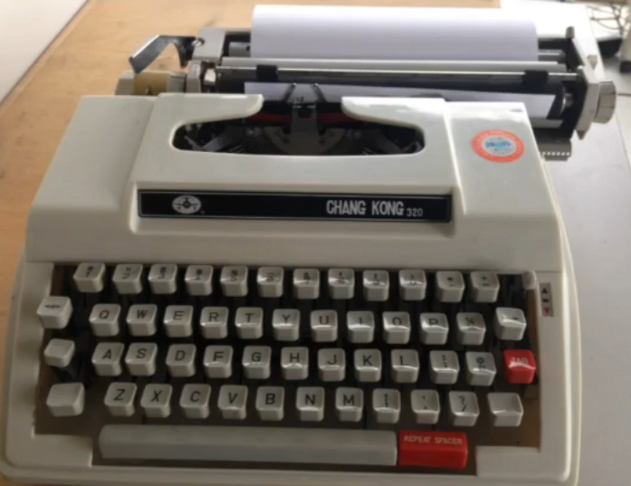

# 06.数据类型和运算

- [06.数据类型和运算](#06%e6%95%b0%e6%8d%ae%e7%b1%bb%e5%9e%8b%e5%92%8c%e8%bf%90%e7%ae%97)
  - [06.1 基础数据类型](#061-%e5%9f%ba%e7%a1%80%e6%95%b0%e6%8d%ae%e7%b1%bb%e5%9e%8b)
    - [C语言的类型](#c%e8%af%ad%e8%a8%80%e7%9a%84%e7%b1%bb%e5%9e%8b)
      - [类型有何不同](#%e7%b1%bb%e5%9e%8b%e6%9c%89%e4%bd%95%e4%b8%8d%e5%90%8c)
      - [sizeof](#sizeof)
    - [整数类型](#%e6%95%b4%e6%95%b0%e7%b1%bb%e5%9e%8b)
      - [数的范围](#%e6%95%b0%e7%9a%84%e8%8c%83%e5%9b%b4)
        - [整数的范围](#%e6%95%b4%e6%95%b0%e7%9a%84%e8%8c%83%e5%9b%b4)
        - [整数越界](#%e6%95%b4%e6%95%b0%e8%b6%8a%e7%95%8c)
      - [unsigned](#unsigned)
      - [整数的输入输出](#%e6%95%b4%e6%95%b0%e7%9a%84%e8%be%93%e5%85%a5%e8%be%93%e5%87%ba)
      - [8进制和16进制](#8%e8%bf%9b%e5%88%b6%e5%92%8c16%e8%bf%9b%e5%88%b6)
      - [选择整数类型](#%e9%80%89%e6%8b%a9%e6%95%b4%e6%95%b0%e7%b1%bb%e5%9e%8b)
    - [浮点类型](#%e6%b5%ae%e7%82%b9%e7%b1%bb%e5%9e%8b)
      - [浮点范围](#%e6%b5%ae%e7%82%b9%e8%8c%83%e5%9b%b4)
      - [浮点的输入输出](#%e6%b5%ae%e7%82%b9%e7%9a%84%e8%be%93%e5%85%a5%e8%be%93%e5%87%ba)
      - [科学计数法](#%e7%a7%91%e5%ad%a6%e8%ae%a1%e6%95%b0%e6%b3%95)
      - [输出精度](#%e8%be%93%e5%87%ba%e7%b2%be%e5%ba%a6)
      - [超过范围的浮点数](#%e8%b6%85%e8%bf%87%e8%8c%83%e5%9b%b4%e7%9a%84%e6%b5%ae%e7%82%b9%e6%95%b0)
      - [浮点运算的精度](#%e6%b5%ae%e7%82%b9%e8%bf%90%e7%ae%97%e7%9a%84%e7%b2%be%e5%ba%a6)
      - [选择浮点类型](#%e9%80%89%e6%8b%a9%e6%b5%ae%e7%82%b9%e7%b1%bb%e5%9e%8b)
    - [字符类型](#%e5%ad%97%e7%ac%a6%e7%b1%bb%e5%9e%8b)
      - [字符的输入输出](#%e5%ad%97%e7%ac%a6%e7%9a%84%e8%be%93%e5%85%a5%e8%be%93%e5%87%ba)
        - [混合输入](#%e6%b7%b7%e5%90%88%e8%be%93%e5%85%a5)
      - [字符计算](#%e5%ad%97%e7%ac%a6%e8%ae%a1%e7%ae%97)
      - [大小写转换](#%e5%a4%a7%e5%b0%8f%e5%86%99%e8%bd%ac%e6%8d%a2)
      - [逃逸字符](#%e9%80%83%e9%80%b8%e5%ad%97%e7%ac%a6)
    - [*逻辑类型（仅C99标准）](#%e9%80%bb%e8%be%91%e7%b1%bb%e5%9e%8b%e4%bb%85c99%e6%a0%87%e5%87%86)
      - [bool](#bool)
        - [bool的运算](#bool%e7%9a%84%e8%bf%90%e7%ae%97)
    - [类型转换](#%e7%b1%bb%e5%9e%8b%e8%bd%ac%e6%8d%a2)
      - [自动类型转换](#%e8%87%aa%e5%8a%a8%e7%b1%bb%e5%9e%8b%e8%bd%ac%e6%8d%a2)
      - [强制类型转换](#%e5%bc%ba%e5%88%b6%e7%b1%bb%e5%9e%8b%e8%bd%ac%e6%8d%a2)
        - [优先级](#%e4%bc%98%e5%85%88%e7%ba%a7)
  - [06.2 其他运算](#062-%e5%85%b6%e4%bb%96%e8%bf%90%e7%ae%97)
    - [逻辑运算](#%e9%80%bb%e8%be%91%e8%bf%90%e7%ae%97)
      - [优先级](#%e4%bc%98%e5%85%88%e7%ba%a7-1)
      - [短路](#%e7%9f%ad%e8%b7%af)
    - [条件运算符](#%e6%9d%a1%e4%bb%b6%e8%bf%90%e7%ae%97%e7%ac%a6)
      - [优先级](#%e4%bc%98%e5%85%88%e7%ba%a7-2)
      - [嵌套条件表达式](#%e5%b5%8c%e5%a5%97%e6%9d%a1%e4%bb%b6%e8%a1%a8%e8%be%be%e5%bc%8f)
    - [逗号运算符](#%e9%80%97%e5%8f%b7%e8%bf%90%e7%ae%97%e7%ac%a6)
  - [06.3 第六章习题](#063-%e7%ac%ac%e5%85%ad%e7%ab%a0%e4%b9%a0%e9%a2%98)

## 06.1 基础数据类型

在前面的学习中我们知道，C是有类型的语⾔。

C语⾔的变量，必须：在使⽤前定义，并且确定类型

C以后的语⾔向两个⽅向发展：

1. C++/Java更强调类型，对类型的检查更严格
2. JavaScript、Python、PHP不看重类型，甚⾄不需要事先定义

像C语言等强调类型的语言遵循类型安全的理论。支持者认为明确的类型有助于尽早发现程序中的简单错误，反对强类型的观点认为过于强调类型迫使程序员⾯对底层、实现⽽⾮事务逻辑。

总的来说，早期语⾔强调类型，⾯向底层的语⾔强调类型。C语⾔需要类型，但是对类型的安全检查并不⾜够。

### C语言的类型

1. 整数
   - char、short、int、long、long long

2. 浮点数
   - float、double、long double

3. 逻辑
   - bool

7. 指针

8. 自定义

其中bool是C99才有的类型

#### 类型有何不同

1. 类型名称：int、long、double
2. 输⼊输出时的格式化：%d、%ld、%lf
3. 所表达的数的范围：char < short < int < float < double
4. 内存中所占据的⼤⼩：1个字节到16个字节
5. 内存中的表达形式：⼆进制数（补码）可以直接作运算、编码不能直接作运算

#### sizeof

C语言中，sizeof是⼀个运算符（如果感到疑惑可以参考[CSDN](https://blog.csdn.net/kangjianwei101/article/details/50363713)或者[stackoverflow](https://stackoverflow.com/questions/1393582/why-is-sizeof-considered-an-operator)），给出某个类型或变量在内存中所占据的字节数，例如

sizeof(int) ，算的是整数类型在内存中所占据的字节数

sizeof(i)，算的是i这个变量在内存中所占据的字节数

<u>***演示***</u>代码如下

```c
#include <stdio.h>

int main(void) {
    int a = 6;
    printf("sizeof(long double)=%ld\n", sizeof(long double));
    printf("sizeof(double)=%ld\n", sizeof(double));
    printf("sizeof(long long)=%ld\n", sizeof(long long));
    printf("sizeof(long)=%ld\n", sizeof(long));
    printf("sizeof(int)=%ld\n", sizeof(int));
    printf("sizeof(a)=%ld\n", sizeof(a));
    return 0;
}
```

如果大家在自己的电脑上尝试，有的同学会发现long double的字节数和我不一样，这是正常的。因为C标准只要求long double比double精度高，具体字节数并没有规定。

sizeof是静态运算符，它的结果在编译时刻就决定了，因此***不要在sizeof的括号⾥做运算，这些运算不会做的。***

### 整数类型

由于C诞生时间较早，所以为了兼容许多老旧设备，很多C语言内的很多内容都可以看出兼容性。

1. char：1字节（8⽐特，即8个二进制的位）
2. short：2字节
3. int：取决于编译器（CPU），通常的意义是“1个字”
4. long：取决于编译器（CPU），通常的意义是“1个字”
5. long long：8字节

大家注意到int和long并没有标准定义内存字节数，所以同学们在自己的电脑上运行可能结果不一样。

为什么int和long的内存大小不确定呢？因为int在C语言中代表了一个字长，对这部分底层感兴趣的同学可以参考下图


int就是代表寄存器字长的，而long则规定至少4字节以及不小于int，但是没有规定其上限。那我们接下来就来研究一下数的范围。

#### 数的范围

对于⼀个字节（8位）即char，可以表达的是：00000000 - 11111111 

其中：00000000 -> 0，11111111 ~ 10000000 -> -1 ~ -128，00000001 ~ 01111111 -> 1 ~ 127

下面的代码就使得char溢出了

```c
#include <stdio.h>

int main(void) {
    char c = 255;
    int a = 255;
    printf("c=%d, a=%d\n", c, a);
    return 0;
}
```

##### 整数的范围

char：1字节：-128 ~ 127

short：2字节：-32768 ~ 32767

int：取决于编译器（CPU），通常的意义是“1个字” -2^31 ~ 2^31-1

long：起码4字节

long long：8字节

##### 整数越界

整数是以纯⼆进制⽅式进⾏计算的，例如：

- 11111111 + 1 -> 100000000 -> 0 
- 01111111 + 1 -> 10000000 -> -128 
- 10000000 - 1 -> 01111111 -> 127

如果操作使得数据超过了他们的范围，那么就会溢出出错，如下面的代码

```c
#include <stdio.h>

int main(void) {
    char c = 127;
    c++;
    printf("c=%d\n", c);
    c = -128;
    c--;
    printf("c=%d\n", c);
    return 0;
}
```

大家如果要方便理解可以参考下面的图，把char的范围想象成一个圆环：


#### unsigned

在整形类型前加上unsigned使得它们成为⽆符号的整数，注意unsigned并没有改变数据内部的⼆进制表达没变，变的是如何看待它们。

```c
#include <stdio.h>

int main(void) {
    unsigned char c = 255;
    int a = 255;
    printf("c=%d, a=%d\n", c, a);
    return 0;
}
```

我可以看到，11111111，对于char，是-1；对于unsigned char，是255。

如果⼀个字⾯量常数想要表达⾃⼰是unsigned，可以在后⾯加u或U，例如255U。

相似的，我们也可以⽤l或L表⽰long(long)。

***不要滥用unsigned，它的初衷并⾮扩展数能表达的范围，⽽是为了做纯⼆进制运算，主要是为了移位以及表达非负数。***

#### 整数的输入输出

我们暂时只需要掌握两种形式：int或long long，%d：int，%u：unsigned，%ld：long long，%lu：unsigned long long。

注意，比int还要小的整数类型都可以使用%d，long则和long long相同。

如果不遵守格式会如何？参考下图

```c
#include <stdio.h>

int main(void) {
    char c = -1;
    int i = -1;
    printf("c=%u,i=%u\n", c, i);
    return 0;
}
```

这个例子我们可以看到，数据除了和它本身的内容有关以外，和程序的看待方式也有密不可分的关系。

#### 8进制和16进制

⼀个以0开始的数字字⾯量是8进制

⼀个以0x开始的数字字⾯量是16进制

%o⽤于8进制，%x⽤于16进制

8进制和16进制只是如何把数字表达为字符串，与内部如何表达数字⽆关

#### 选择整数类型

学习了那么多整数类型，大家可能已经有点晕了。那么为什么整数要有那么多种？为了准确表达内存，做底层程序的需要。

***在我们大部分的实际应用中，如果没有特殊需要（比如做底层），就选择int。***

- 现代的CPU的字⻓普遍是32位或64位，⼀次内存读写就是⼀个int，⼀次计算也是⼀个int，选择更短的类型（比如short或者char）不会更快，甚⾄可能更慢。具体参考字长那里的图。
- 现代的编译器⼀般会设计内存对⻬，所以更短的类型实际在内存中有可能也占据⼀个int的⼤⼩（虽然sizeof告诉你更⼩）。这一点我们后来会继续深入。

***unsigned与否只是输出的不同，内部计算是⼀样的。***

本节忽略了很多计算机和数学相关的原理，有兴趣的同学可以参考[C6补充资料](./C6/supplement.md)

### 浮点类型

#### 浮点范围

| 类型   | 字⻓ | 范围                                                      | 有效数字 |
| ------ | ---- | --------------------------------------------------------- | -------- |
| float  | 32   | ±(1.20x10<sup>-38</sup>~3.40x10<sup>38</sup>),0,±inf,nan  | 7        |
| double | 64   | ±(2.2x10<sup>-308</sup>~1.79x10<sup>308</sup>),0,±inf,nan | 15       |

想要更好理解范围的同学们可以参考下图


#### 浮点的输入输出

| 类型   | scanf | printf |
| ------ | ----- | ------ |
| float  | %f    | %f,%e  |
| double | %lf   | %f,%e  |

printf中的%e代表科学计数法，也可以用%E代替%e这样科学计数法里面会是大写的E，例子如下

```c
# include <stdio.h>

int main(void) {
    printf("%e\n", 1234.56789);
    printf("%E\n", 1234.56789);
    return 0;
}
```

#### 科学计数法

科学计数法表示参考下图


#### 输出精度

在%和f之间加上.n可以指定输出⼩数点后⼏位，这样的输出是做4舍5⼊的，例子如下

```c
# include <stdio.h>

int main(void) {
    printf("%.3f\n", -0.0049);
    printf("%.30f\n", -0.0049);
    printf("%.3f\n", -0.00049);
    return 0;
}
```

为什么第二个printf会是这种结果呢？因为在数学理论中，数是连续的，而在计算机中并不是，上面浮点数的范围就是一种最小单位。而第三个printf虽然有4舍5入，但是符号依然保留。

#### 超过范围的浮点数

同整数类型一样，浮点数类型也是有边界的，但是对于超越边界的数浮点数会有另外的表达方式。

- printf输出inf表⽰超过范围的浮点数：±∞
- printf输出nan表⽰不存在的浮点数

例子如下

```c
# include <stdio.h>

int main(void) {
    printf("%f\n", 12.0 / 0.0);
    printf("%f\n", -12.0 / 0.0);
    printf("%f\n", 0.0 / 0.0);
    return 0;
}
```

而用整数除以0编译器会直接报错。

#### 浮点运算的精度

浮点的运算并不能保证精度，例子如下

```c
# include <stdio.h>

int main(void) {
    float a, b, c;
    a = 1.345f;
    b = 1.123f;
    c = a + b;
    if (c == 2.468) {
        printf("Yes\n");
    } else {
        printf("No!c=%.10f,or%f\n", c, c);
    }
    return 0;
}
```

为什么变量a和b后面要带f呢，因为如果不带的话会默认为double，只有带了f才会识别为float类型。

那么我们如何去求相等呢？

实际上我们只能够通过近似和精度控制来操作，例如作差比精度小即可

abs(f1-f2) < 1e-12
$$
|f1-f2|<1e^{-12}
$$


核心原则是精度要比所使用的类型精度要高即可

#### 选择浮点类型

如果没有特殊需要，只使⽤double 。

现代CPU能直接对double做硬件运算，性能不会⽐float差，在64位的机器上，数据存储的速度也不⽐float慢。

本节忽略了很多计算机和数学相关的原理，有兴趣的同学可以参考[C6补充资料](./C6/supplement.md)

### 字符类型

char（character）是⼀种整数，也是⼀种特殊的类型：字符。这是因为：

- 可以⽤单引号表⽰的字符字⾯量：'a', '1'
- ''也是⼀个字符
- printf和scanf⾥⽤%c来输⼊输出字符

#### 字符的输入输出

如何输⼊'1'这个字符给char c？

- scanf("%c", &c);->1
- scanf("%d", &i); c=i; ->49

示例代码

```c
#include <stdio.h>

int main(void) {
    char a;
    scanf("%c", &a);
    printf("%d\n", a);
    printf("'%c'\n", a);
    return 0;
}
```

'1'的ASCII编码是49，所以当c==49时，它代表'1'

- printf("%i %c\n", c,c ); 
- ⼀个49各⾃表述！ 

##### 混合输入

有何不同？scanf("%d %c", &i, &c); scanf("%d%c", &i, &c);

空格会影响读取输入，例子如下

```c
#include <stdio.h>

int main(void) {
    int a;
    char c;
    scanf("%d %c", &a, &c);
    printf("%d %d\n", a, c);
    scanf("%d%c", &a, &c);
    printf("%d %d\n", a, c);
    return 0;
}
```

#### 字符计算

⼀个字符加⼀个数字得到ASCII码表中那个数之后的字符，例子如下

```c
#include <stdio.h>

int main(void) {
    char c = 'A';
    c++;
    printf("%c\n", c);
    return 0;
}
```

两个字符的减，得到它们在表中的距离

```c
#include <stdio.h>

int main(void) {
    printf("%d\n", 'Z' - 'A');
    return 0;
}
```

#### 大小写转换

字⺟在ASCII表中是顺序排列的

⼤写字⺟和⼩写字⺟是分开排列的，并不在⼀起

'a'-'A'可以得到两段之间的距离，于是

- char+'a'-'A'可以把⼀个⼤写字⺟变成⼩写字⺟
- char+'A'-'a'可以把⼀个⼩写字⺟变成⼤写字⺟

#### 逃逸字符

在02.5中，我们遇到了如下的例子

```c
printf("请分别输入身高的英尺和英寸，"
          "如输出\"5 7\"表示5英尺7英寸：");
```

里面的\"是一种逃逸字符，所谓的逃逸字符，就是用来表达无法印出来的控制字符或特殊字符，它由一个反斜杠\开头，后面跟上另一个字符，这两个字符结合起来组成了另一个字符。

下面是一个常用字符表，如果要查全部字符可以对照[C6补充资料](./C6/supplement.md)里的ASCII码表

| 字符 | 意义           |
| ---- | -------------- |
| \b   | 回退一格       |
| \t   | 到下一个表格位 |
| \n   | 换行           |
| \r   | 回车           |
| \"   | 双引号         |
| \'   | 单引号         |
| \\\  | 反斜杠本身     |

要注意的是，\b的表现和shell/终端有关，但是\b本身只代表回退而不是删除，代码如下

```c
#include <stdio.h>

int main(void) {
    printf("hello worl\b\bd\n");
    return 0;
}
```

详细拆解流程如下


\t制表符


- 每⾏的固定位置
- ⼀个\t使得输出从下⼀个制表位开始
- ⽤\t才能使得上下两⾏对⻬

回⻋换⾏\r\n

来源自打字机的操作



[视频讲解回车换行](https://www.bilibili.com/video/av29259814)

\r回车是指移动到初始位置

\n换行是指移动到下一行

我们平时的\n会被shell/终端翻译成回车换行

### *逻辑类型（仅C99标准）

#### bool

\#include <stdbool.h>

之后就可以使⽤bool和true、false

##### bool的运算

bool实际上还是以int的⼿段实现的，所以可以当作int来计算，也只能当作int来输⼊输出

### 类型转换

#### 自动类型转换

当运算符的两边出现不⼀致的类型时，会⾃动转换成较⼤的类型

- ⼤的意思是能表达的数的范围更⼤
- char -> short -> int -> long -> long long 
-  int -> float -> double
- 对于printf，任何⼩于int的类型会被转换成int；float会被转换成double
- 但是scanf不会，要输⼊short，需要%hd

#### 强制类型转换

要把⼀个量强制转换成另⼀个类型（通常是较⼩的类型），语法是

(*类型*)*值*

例如

```c
(int)10.2;
(short)32;
```

注意这时候的安全性，⼩的变量不总能表达⼤的量，例如

```c
(short)32768
```

##### 优先级

强制类型转换的优先级⾼于四则运算

## 06.2 其他运算

### 逻辑运算

逻辑运算是对逻辑量进⾏的运算，结果只有0（false）或1（true）

逻辑量是关系运算或逻辑运算的结果

| 运算符 | 描述   | 示例   | 结果                                               |
| ------ | ------ | ------ | -------------------------------------------------- |
| !      | 逻辑非 | !a     | 如果a是true结果就是false，如果a是false结果就是true |
| &&     | 逻辑与 | a&&b   | 如果a和b都是true，结果就是true；否则就是false      |
| \|\|   | 逻辑或 | a\|\|b | 如果a和b有一个是true，结果为true；否则是false      |

如果要表达数学中的区间，如：x∈(4,6)或x∈[4,6]，应该如何写C的表达式？

4<x<6不是C能正确计算的式子，因为4<x的结果是一个逻辑值（0或1）

如何判断一个字符c是否是大写字母？

```c
c >= 'A' && c <= 'Z'
```

再理解下面几个式子

```c
age > 20 && age < 30

index < 0 || index > 99

!age < 20
```

#### 优先级

! > && > ||

补充逻辑运算符后的运算符优先级表如下

| 优先级 | 运算符           | 综合性                 |
| ------ | ---------------- | ---------------------- |
| 1      | ()               | 从左到右               |
| 2      | ! + - ++ --      | 从右到左（单目的+和-） |
| 3      | */%              | 从左到右               |
| 4      | +-               | 从左到右               |
| 5      | < <= > >=        | 从左到右               |
| 6      | == !=            | 从左到右               |
| 7      | &&               | 从左到右               |
| 8      | \|\|             | 从左到右               |
| 9      | = += -= *= /= %= | 从右到左               |

#### 短路

逻辑运算是⾃左向右进⾏的，如果左边的结果已经能够决定结果了，就不会做右边的计算

- a==6 && b==1不会判断b == 1如果a == 6不成立
- a==6 || b+=1不会执行b += 1如果a == 6成立

对于&&，如果左边是false就不做右边了；对于||，如果左边是true就不做右边了。

***因此，不要把赋值，包括复合赋值组合进表达式***

### 条件运算符（三目运算符）

看下面这行代码

```c
count = (count > 20) ? count - 10 : count + 10;
```

=右边分别表示条件、条件满⾜时的值和条件不满⾜时的值，等价于

```c
if (count > 20) {
    count = count - 10;
} else {
    count = count + 10;
}
```

#### 优先级

条件运算符的优先级⾼于赋值运算符，但是低于其他运算符

大家可以尝试以下例子：

```c
m < n ? x : a + 5

a++ >= 1 && b-- > 2 ? a : b

x = 3 * a > 5 ? 5 : 20
```

#### 嵌套条件表达式

条件运算符是自右向左结合的

***避免使用嵌套条件表达式***

### 逗号运算符

逗号⽤来连接两个表达式，并以其右边的表达式的值作为它的结果。逗号的优先级是所有的运算符中最低的，所以它两边的表达式会先计算；逗号的组合关系是⾃左向右，所以左边的表达式会先计算，⽽右边的表达式的值就留下来作为逗号运算的结果。

主要在for中使⽤，例子如下

for ( i=0, j=10; i<j; i++, j- - ) ……

***除此之外，也请尽量避免使用逗号运算符***

## 06.3 第六章习题

1. 找出所有整数类型（包括unsigned）在你的编译器下的最大值和最小值以及最多数位是多少。
2. 让用户输入字符，如果是大写就输出小写，如果是小写就输出大写。
3. 实现绝对值功能，并且判断浮点数的精度。
4. 在不引入新变量的情况下交换两个整数变量的值，考虑一下你的方法有没有漏洞？