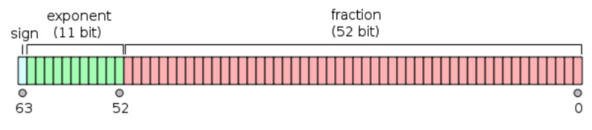

### 整数的内部表达

计算机内部⼀切都是⼆进制，例如

- 18 -> 00010010
- 0 -> 00000000 
- -18 -> ?

### 如何表⽰负数

⼗进制⽤“-”来表⽰负数，在做计算的时候

- 加减是做相反的运算
- 乘除时当作正数，计算完毕后对结果的符号取反

### ⼆进制负数

1个字节可以表达的数：

00000000 — 11111111 (0-255)

三种⽅案：

1. 仿照⼗进制，有⼀个特殊的标志表⽰负数
2. 取中间的数为0，如1000000表⽰0，⽐它⼩的是负数，⽐它⼤的是正数
3. 补码

### 补码

考虑-1，我们希望-1 + 1 -> 0。如何能做到？

- 0 -> 00000000
- 1 -> 00000001
- 11111111 + 00000001 -> 00000000

因为0 - 1 —> -1，所以，-1 = 

- (1)00000000 － 00000001 -> 11111111 
- 11111111被当作纯⼆进制看待时，是255，被当作补码看待时是-1
- 同理，对于-a，其补码就是0-a，实际是2^n - a，n是这种类型的位数

补码的意义就是拿补码和源码可以加出一个“溢出”的0。

### 8进制和16进制

16进制很适合表达⼆进制数据，因为4位⼆进制正好是⼀个16进制位

8进制的⼀位数字正好表达3位⼆进制，因为历史原因，早期计算机的字⻓是12的倍数，⽽⾮8

### 浮点数的内部表达

浮点数在计算时是由专⽤的硬件部件实现的

计算double和float所⽤的部件是⼀样的，参照下图

### ASCII码表

| ASCII值 | 控制字符 | ASCII值 | 控制字符 | ASCII值 | 控制字符 | ASCII值 | 控制字符 |
| :------ | :------- | :------ | :------- | :------ | :------- | :------ | :------- |
| 0       | NUT      | 32      | (space)  | 64      | @        | 96      | 、       |
| 1       | SOH      | 33      | !        | 65      | A        | 97      | a        |
| 2       | STX      | 34      | "        | 66      | B        | 98      | b        |
| 3       | ETX      | 35      | #        | 67      | C        | 99      | c        |
| 4       | EOT      | 36      | $        | 68      | D        | 100     | d        |
| 5       | ENQ      | 37      | %        | 69      | E        | 101     | e        |
| 6       | ACK      | 38      | &        | 70      | F        | 102     | f        |
| 7       | BEL      | 39      | '        | 71      | G        | 103     | g        |
| 8       | BS       | 40      | (        | 72      | H        | 104     | h        |
| 9       | HT       | 41      | )        | 73      | I        | 105     | i        |
| 10      | LF       | 42      | *        | 74      | J        | 106     | j        |
| 11      | VT       | 43      | +        | 75      | K        | 107     | k        |
| 12      | FF       | 44      | ,        | 76      | L        | 108     | l        |
| 13      | CR       | 45      | -        | 77      | M        | 109     | m        |
| 14      | SO       | 46      | .        | 78      | N        | 110     | n        |
| 15      | SI       | 47      | /        | 79      | O        | 111     | o        |
| 16      | DLE      | 48      | 0        | 80      | P        | 112     | p        |
| 17      | DCI      | 49      | 1        | 81      | Q        | 113     | q        |
| 18      | DC2      | 50      | 2        | 82      | R        | 114     | r        |
| 19      | DC3      | 51      | 3        | 83      | S        | 115     | s        |
| 20      | DC4      | 52      | 4        | 84      | T        | 116     | t        |
| 21      | NAK      | 53      | 5        | 85      | U        | 117     | u        |
| 22      | SYN      | 54      | 6        | 86      | V        | 118     | v        |
| 23      | TB       | 55      | 7        | 87      | W        | 119     | w        |
| 24      | CAN      | 56      | 8        | 88      | X        | 120     | x        |
| 25      | EM       | 57      | 9        | 89      | Y        | 121     | y        |
| 26      | SUB      | 58      | :        | 90      | Z        | 122     | z        |
| 27      | ESC      | 59      | ;        | 91      | [        | 123     | {        |
| 28      | FS       | 60      | <        | 92      | /        | 124     | \|       |
| 29      | GS       | 61      | =        | 93      | ]        | 125     | }        |
| 30      | RS       | 62      | >        | 94      | ^        | 126     | `        |
| 31      | US       | 63      | ?        | 95      | _        | 127     | DEL      |