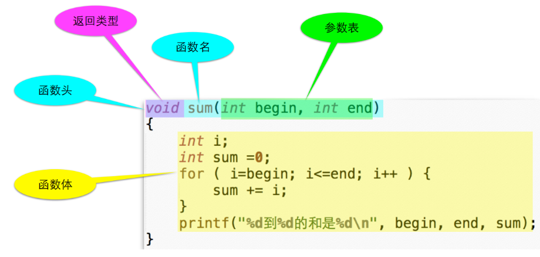

# 07.函数

- [07.函数](#07%e5%87%bd%e6%95%b0)
  - [07.1 函数的定义和使用](#071-%e5%87%bd%e6%95%b0%e7%9a%84%e5%ae%9a%e4%b9%89%e5%92%8c%e4%bd%bf%e7%94%a8)
    - [什么是函数](#%e4%bb%80%e4%b9%88%e6%98%af%e5%87%bd%e6%95%b0)
    - [函数的定义](#%e5%87%bd%e6%95%b0%e7%9a%84%e5%ae%9a%e4%b9%89)
    - [调用函数](#%e8%b0%83%e7%94%a8%e5%87%bd%e6%95%b0)
    - [函数返回](#%e5%87%bd%e6%95%b0%e8%bf%94%e5%9b%9e)
      - [从函数中返回值](#%e4%bb%8e%e5%87%bd%e6%95%b0%e4%b8%ad%e8%bf%94%e5%9b%9e%e5%80%bc)
      - [没有返回值的函数](#%e6%b2%a1%e6%9c%89%e8%bf%94%e5%9b%9e%e5%80%bc%e7%9a%84%e5%87%bd%e6%95%b0)
  - [07.2 函数的参数和变量](#072-%e5%87%bd%e6%95%b0%e7%9a%84%e5%8f%82%e6%95%b0%e5%92%8c%e5%8f%98%e9%87%8f)
    - [函数先后关系](#%e5%87%bd%e6%95%b0%e5%85%88%e5%90%8e%e5%85%b3%e7%b3%bb)
    - [函数原型](#%e5%87%bd%e6%95%b0%e5%8e%9f%e5%9e%8b)
    - [调用函数](#%e8%b0%83%e7%94%a8%e5%87%bd%e6%95%b0-1)
      - [类型不匹配？](#%e7%b1%bb%e5%9e%8b%e4%b8%8d%e5%8c%b9%e9%85%8d)
      - [传过去的是什么？](#%e4%bc%a0%e8%bf%87%e5%8e%bb%e7%9a%84%e6%98%af%e4%bb%80%e4%b9%88)
        - [传值](#%e4%bc%a0%e5%80%bc)
    - [本地变量](#%e6%9c%ac%e5%9c%b0%e5%8f%98%e9%87%8f)
      - [变量的生存期和作用域](#%e5%8f%98%e9%87%8f%e7%9a%84%e7%94%9f%e5%ad%98%e6%9c%9f%e5%92%8c%e4%bd%9c%e7%94%a8%e5%9f%9f)
      - [本地变量的规则](#%e6%9c%ac%e5%9c%b0%e5%8f%98%e9%87%8f%e7%9a%84%e8%a7%84%e5%88%99)
    - [函数没有参数时](#%e5%87%bd%e6%95%b0%e6%b2%a1%e6%9c%89%e5%8f%82%e6%95%b0%e6%97%b6)
    - [逗号运算符？](#%e9%80%97%e5%8f%b7%e8%bf%90%e7%ae%97%e7%ac%a6)
    - [函数嵌套？](#%e5%87%bd%e6%95%b0%e5%b5%8c%e5%a5%97)
    - [这是什么？](#%e8%bf%99%e6%98%af%e4%bb%80%e4%b9%88)
    - [关于main函数](#%e5%85%b3%e4%ba%8emain%e5%87%bd%e6%95%b0)
  - [07.3 第七章练习](#073-%e7%ac%ac%e4%b8%83%e7%ab%a0%e7%bb%83%e4%b9%a0)

## 07.1 函数的定义和使用

在第五章练习中，我们遇到过求区间内素数之和的问题。代码如下

```c
#include <stdio.h>

int main(void) {
    int m, n;
    scanf("%d %d", &m, &n);
    if (m == 1) {
        m = 2;
    }
    for (int i = m; i <= n; i++) {
        int isPrime = 1;
        int k;
        for (k = 2; k < i - 1; k++) {
            if (i % k == 0) {
                isPrime = 0;
                break;
            }
        }
        if (isPrime) {
            sum += i;
            cnt++;
        }
    }
    printf("%d %d\n", cnt, sum);
    return 0;
}
```

这段代码中间有一个求素数的过程，使得代码看起来比较冗余。如果现在我们把这部分功能抽离出来作为函数，那么代码就会相对简洁许多。

```c
#include <stdio.h>

int isPrime(int i) {
    int ret = 1;
    for (int k = 2; k < i - 1; k++) {
        if (i % k == 0) {
            ret = 0;
            break;
        }
    }
    return ret;
}

int main(void) {
    int m, n;
    int sum = 0, cnt = 0;
    scanf("%d %d", &m, &n);
    if (m == 1) {
        m = 2;
    }
    for (int i = m; i <= n; i++) {
        if (isPrime(i)) {
            sum += i;
            cnt++;
        }
    }
    printf("%d %d\n", cnt, sum);
    return 0;
}
```

isPrime函数用于判断变量i是否是素数，我们不仅能在这个程序中调用，而且以后也可以多次重复利用。

我们现在再来看一个例子，比如说我们常用的功能求和，求出从1到10、20到30和35到45的三个和。

```c
#include <stdio.h>

int main(void) {
    int i, sum = 0;
    for (i = 1; i <= 10; i++) {
        sum += i;
    }
    printf("sum of %d to %d is %d\n", 1, 10, sum);
    sum = 0;
    for (i = 20; i <= 30; i++) {
        sum += i;
    }
    printf("sum of %d to %d is %d\n", 20, 30, sum);
    sum = 0;
    for (i = 35; i <= 45; i++) {
        sum += i;
    }
    printf("sum of %d to %d is %d\n", 35, 45, sum);
    return 0;
}
```

在这段代码中，有相似部分较多，而且几乎一模一样，因此在这个编程过程中有很多ctrl-c和ctrl-v的操作。这种“代码复制”是程序质量不良的表现。日后维护的过程中可能需要大动筋骨。

为了改变这种情况，我们可以把这个重复功能抽离出来做一个函数，例子如下

```c
#include <stdio.h>

void sum(int begin, int end) {
    int sum = 0;
    printf("sum of %d to %d is ", begin, end);
    for (; begin <= end; begin++) {
        sum += begin;
    }
    printf("%d\n", sum);
}

int main(void) {
    sum(1, 10);
    sum(20, 30);
    sum(35, 45);
    return 0;
}
```

### 什么是函数

函数是⼀块代码，接收零个或多个参数，做⼀件事情，并返回零个或⼀个值。

可以先想像成数学中的函数：y = f(x)

### 函数的定义



### 调用函数

函数名(参数值)

()起到了表示函数调用的重要作用

- 即使没有参数也需要()，否则C语言无法正确识别函数调用

如果有参数，则需要给出正确的数量和顺序

这些值会被按照顺序依次用来初始化函数中的参数

### 函数返回

函数知道每⼀次是哪⾥调⽤它，会返回到正确的地⽅

#### 从函数中返回值

return停⽌函数的执⾏，并送回⼀个值

- return;
- return 表达式;

⼀个函数⾥可以出现多个return 语句，但是为了遵循单一出口原则我们尽量不要用太多的return。

如果函数有返回值，那么也可以用于赋值给变量；也可以再传递给函数；甚至可以丢弃，有的时候要的是副作用。例子如下

```c
#include <stdio.h>

int example(int a) {
    printf("Hello\n");
    return a;
}

int main(void) {
    // 赋值给变量
    int a = example(10);
    // 丢弃
    example(5);
    // 传递给函数
    a = example(example(20));
    // 传递给函数
    printf("%d\n", example(0));
    return 0;
}
```

#### 没有返回值的函数

void 函数名(参数表)

不能使⽤带值的return，当然如果函数有返回值，则必须使用带值的return

- 可以没有return

调⽤的时候不能做返回值的赋值

## 07.2 函数的参数和变量 

### 函数先后关系

在07.1中，sum函数或者其他函数总是在main函数之前出现，因为：

- C的编译器⾃上⽽下顺序分析你的代码
- 在看到sum(1,10)的时候，它需要知道sum()的样⼦
- 也就是sum()要⼏个参数，每个参数的类型如何，返回什么类型
- 这样它才能检查你对sum()的调⽤是否正确

否则的话，也就是把要调⽤的函数放到下⾯了

旧标准会假设你所调⽤的函数所有的参数都是int，返回也是int，如果恰好不对可能会报错

大家可以尝试在自己的IDE上编译，部分编译器没有那么严格也许不会检查可以通过，但请不要这样做。

当然，如果我们把全部函数内容放在main函数前面，我们很难一眼看到main函数，不方便阅读，这个时候我们可以先使用函数原型。

### 函数原型

函数头，以分号“;”结尾，就构成了函数的原型

函数原型的目的是告诉编译器这个函数⻓什么样

- 名称
- 参数（数量及类型）
- 返回类型

旧标准习惯把函数原型写在调⽤它的函数⾥⾯

现在⼀般写在调⽤它的函数前⾯

原型⾥可以不写参数的名字，但是⼀般仍然写上便于理解，例子如下

```c
#include <stdio.h>

int example(int a); // 函数原型

int main(void) {
    int a = example(10); // 根据函数原型判定
    
    return 0;
}

int example(int a) { // 实际函数头
    return a;
}
```

### 调用函数

如果函数有参数，调⽤函数时必须传递给它数量、类型正确的值

可以传递给函数的值是表达式的结果，这包括：

- 字⾯量
- 变量
- 函数的返回值
- 计算的结果

例子如下

```c
int a = 5, b = 6, c;
c = max(10, 12);
c = max(a, b);
c = max(c, 23);
c = max(max(23, 45), a);
c = max(23 + 45, b);
```

#### 类型不匹配？

调⽤函数时给的值与参数的类型不匹配是C语⾔传统上最⼤的漏洞

编译器总是悄悄替你把类型转换好（自动类型转换），但是这很可能不是你所期望的

后续的语⾔，C++/Java在这⽅⾯很严格

#### 传过去的是什么？

***C语言在调用函数时，永远只能传值给函数***，例子如下

```c
#include <stdio.h>

void swap(int a, int b);

int main(void) {
    int a = 5, b = 10;
    swap(a, b);
    printf("In main, a=%d,b=%d\n", a, b);
    return 0;
}

void swap(int a, int b) {
    int temp = a;
    a = b;
    b = temp;
    printf("In swap, a=%d,b=%d\n", a, b);
    return;
}
```

我们可以看到，a和b的值其实并没有交换，我们只是把a和b的值传到了swap而已。同学们可以使用IDE的调试器查看结果。

##### 传值

每个函数有⾃⼰的变量空间，参数也位于这个独⽴的空间中，和其他函数没有关系

过去，对于函数参数表中的参数，叫做“形式参数”，调⽤函数时给的值，叫做“实际参数” ，概念来自于比较古老的编程语言FORTRAN

由于容易让初学者误会实际参数就是实际在函数中进⾏计算的参数，误会调⽤函数的时候把变量⽽不是值传进去了，所以我们不建议继续⽤这种古⽼的⽅式来称呼它们

我们认为，它们是参数和值的关系，例子如下

```c
#include <stdio.h>

void swap(int a, int b); // 参数

int main(void) {
    int a = 5, b = 10;
    swap(a, b); // 值
    printf("In main, a=%d,b=%d\n", a, b);
    return 0;
}

void swap(int a, int b) { // 参数
    int temp = a;
    a = b;
    b = temp;
    printf("In swap, a=%d,b=%d\n", a, b);
    return;
}
```

### 本地变量

函数的每次运⾏，就产⽣了⼀个独⽴的变量空间，在这个空间中的变量，是函数的这次运⾏所独有的，称作本地变量

定义在函数内部的变量就是本地变量

参数也是本地变量

#### 变量的生存期和作用域

⽣存期：什么时候这个变量开始出现了，到什么时候它消亡了

作⽤域：在（代码的）什么范围内可以访问这个变量（这个变量可以起作⽤）

对于本地变量，这两个问题的答案是统⼀的：⼤括号内——块

#### 本地变量的规则

本地变量是定义在块内的

- 它可以是定义在函数的块内
- 也可以定义在语句的块内，比如在if内定义一个变量
- 甚⾄可以随便拉⼀对⼤括号来定义变量

程序运⾏进⼊这个块之前，其中的变量不存在，离开这个块，其中的变量就消失了

1. 块外⾯定义的变量在⾥⾯仍然有效

2. 块⾥⾯定义了和外⾯同名的变量则掩盖了外⾯的

3. 不能在⼀个块内定义同名的变量

4. 本地变量不会被默认初始化

5. 参数在进⼊函数的时候被初始化了

### 函数没有参数时

比如一个函数void f

void f(void);

还是

void f();

在C89中，f()

- 表⽰f函数的参数表未知，并不表⽰没有参数。为了避免可能的错误，函数如果没有参数就使用void传入

### 逗号运算符？

调⽤函数时的逗号和逗号运算符怎么区分？

调⽤函数时的圆括号⾥的逗号是标点符号，不是运算符，注意以下两个函数调用的区别

```c
f(a, b);
f((a, b));
```

### 函数嵌套？

C语⾔不允许函数嵌套定义，允许声明但不允许定义

### 这是什么？

```c
int i, j, sum(int a, int b); 
```

上面这种写法是允许的，但是请尽量避免这样声明。

```c
return (i);
```

圆括号没有意义，而且会让人误解return是一个函数。

### 关于main函数

int main()也是⼀个函数，是程序的入口，但是其实之前还有许多其他处理。

要不要写成int main(void)？

return的0有⼈看吗？返回给调用了main()函数的“东西”，是有意义的。返回0一般表示运行正常，任何非0返回值代表运行错误。

- Windows：if errorlevel 1 …
- Unix Bash：echo $? 
- Csh：echo $status

根据C99标准，main函数有且仅有三种形式

```c
int main(void); // 无参数
int main(int argc, char *argv[]); // 命令行参数
// some other implementation-defined manner
```

<u>***即使编译器不警告不报错，也请避免使用void main()***</u>

参考[关于void main的讨论](https://www.zhihu.com/question/358133724)

## 07.3 第七章练习

1. 编写power()函数，返回输入为double类型的正整数次幂。
2. 改进1中的power()函数，使其能计算负整数次幂。
3. 继续改进，处理0的任何次幂为0，其他任何数的0次幂为1。
4. 编写斐波那契数列Fibonacci()函数，输入位数，输出对应位数的斐波那契数字，分别用循环和递归实现。