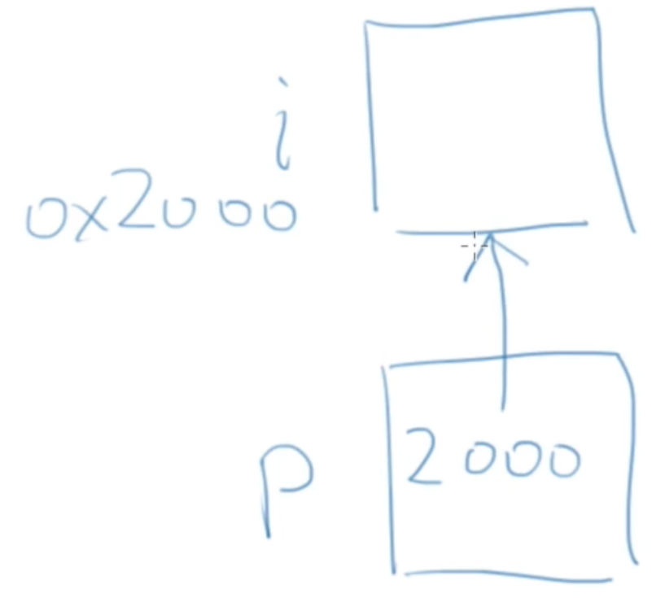

# 09.指针及其运算

- [09.指针及其运算](#09%e6%8c%87%e9%92%88%e5%8f%8a%e5%85%b6%e8%bf%90%e7%ae%97)
  - [09.1 指针](#091-%e6%8c%87%e9%92%88)
    - [取地址运算符&](#%e5%8f%96%e5%9c%b0%e5%9d%80%e8%bf%90%e7%ae%97%e7%ac%a6)
      - [&不能取的地址](#%e4%b8%8d%e8%83%bd%e5%8f%96%e7%9a%84%e5%9c%b0%e5%9d%80)
        - [试试这些&运算](#%e8%af%95%e8%af%95%e8%bf%99%e4%ba%9b%e8%bf%90%e7%ae%97)
    - [指针](#%e6%8c%87%e9%92%88)
      - [指针变量](#%e6%8c%87%e9%92%88%e5%8f%98%e9%87%8f)
      - [作为参数的指针](#%e4%bd%9c%e4%b8%ba%e5%8f%82%e6%95%b0%e7%9a%84%e6%8c%87%e9%92%88)
      - [用*访问那个地址上的变量](#%e7%94%a8%e8%ae%bf%e9%97%ae%e9%82%a3%e4%b8%aa%e5%9c%b0%e5%9d%80%e4%b8%8a%e7%9a%84%e5%8f%98%e9%87%8f)
        - [*左值之所以叫左值](#%e5%b7%a6%e5%80%bc%e4%b9%8b%e6%89%80%e4%bb%a5%e5%8f%ab%e5%b7%a6%e5%80%bc)
      - [scanf传入地址](#scanf%e4%bc%a0%e5%85%a5%e5%9c%b0%e5%9d%80)
      - [指针应⽤场景](#%e6%8c%87%e9%92%88%e5%ba%94%e2%bd%a4%e5%9c%ba%e6%99%af)
      - [指针最常见的错误](#%e6%8c%87%e9%92%88%e6%9c%80%e5%b8%b8%e8%a7%81%e7%9a%84%e9%94%99%e8%af%af)
    - [指针与数组](#%e6%8c%87%e9%92%88%e4%b8%8e%e6%95%b0%e7%bb%84)
      - [数组参数](#%e6%95%b0%e7%bb%84%e5%8f%82%e6%95%b0)
      - [数组变量是特殊的指针](#%e6%95%b0%e7%bb%84%e5%8f%98%e9%87%8f%e6%98%af%e7%89%b9%e6%ae%8a%e7%9a%84%e6%8c%87%e9%92%88)
  - [09.2 *指针与const](#092-%e6%8c%87%e9%92%88%e4%b8%8econst)
    - [指针是const](#%e6%8c%87%e9%92%88%e6%98%afconst)
    - [所指是const](#%e6%89%80%e6%8c%87%e6%98%afconst)
    - [转换](#%e8%bd%ac%e6%8d%a2)
    - [const数组](#const%e6%95%b0%e7%bb%84)
    - [保护数组值](#%e4%bf%9d%e6%8a%a4%e6%95%b0%e7%bb%84%e5%80%bc)
  - [09.3 指针运算](#093-%e6%8c%87%e9%92%88%e8%bf%90%e7%ae%97)
    - [指针运算](#%e6%8c%87%e9%92%88%e8%bf%90%e7%ae%97)
      - [*p++](#p)
    - [指针比较](#%e6%8c%87%e9%92%88%e6%af%94%e8%be%83)
    - [0地址](#0%e5%9c%b0%e5%9d%80)
    - [指针的类型](#%e6%8c%87%e9%92%88%e7%9a%84%e7%b1%bb%e5%9e%8b)
      - [指针的类型转换](#%e6%8c%87%e9%92%88%e7%9a%84%e7%b1%bb%e5%9e%8b%e8%bd%ac%e6%8d%a2)
    - [指针的作用](#%e6%8c%87%e9%92%88%e7%9a%84%e4%bd%9c%e7%94%a8)
    - [动态内存分配](#%e5%8a%a8%e6%80%81%e5%86%85%e5%ad%98%e5%88%86%e9%85%8d)
      - [输入数据](#%e8%be%93%e5%85%a5%e6%95%b0%e6%8d%ae)
      - [malloc](#malloc)
      - [没空间了？](#%e6%b2%a1%e7%a9%ba%e9%97%b4%e4%ba%86)
      - [free()](#free)
    - [常见问题](#%e5%b8%b8%e8%a7%81%e9%97%ae%e9%a2%98)
    - [函数间传递指针](#%e5%87%bd%e6%95%b0%e9%97%b4%e4%bc%a0%e9%80%92%e6%8c%87%e9%92%88)
      - [好的模式](#%e5%a5%bd%e7%9a%84%e6%a8%a1%e5%bc%8f)
      - [函数返回指针](#%e5%87%bd%e6%95%b0%e8%bf%94%e5%9b%9e%e6%8c%87%e9%92%88)
      - [函数返回数组？](#%e5%87%bd%e6%95%b0%e8%bf%94%e5%9b%9e%e6%95%b0%e7%bb%84)
  - [09.4 第九章习题](#094-%e7%ac%ac%e4%b9%9d%e7%ab%a0%e4%b9%a0%e9%a2%98)

## 09.1 指针

### 取地址运算符&

现在，我们终于开始研究scanf("%d", &i);⾥的& 。它的作用是获得变量的地址，它的操作数必须是变量，C中的变量都存在内存中，都有地址

```c
int i = 0; printf("%p",&i);
```

地址的⼤⼩是否与int相同取决于编译器和硬件架构

```c
int i; printf("%p",&i);
```

#### &不能取的地址

&不能对没有地址的东⻄取地址，必须是变量（左值）

- &(a+b)?
- &(a++)?
- &(++a)?

##### 试试这些&运算

- 本地变量的地址
- 本地相邻的变量的地址-地址储存在堆栈
- &的结果的sizeof
- 数组的地址
- 数组单元的地址
- 相邻的数组单元的地址

如果能够将取得的变量的地址传递给⼀个函数，能否通过这个地址在那个函数内访问这个变量？

```c
scanf("%d", &i); 
```

scanf()的原型应该是怎样的？我们需要⼀个参数能保存别的变量的地址，如何表达能够保存地址的变量？

### 指针

指针，就是保存地址的变量

```c
int i;
int* p = &i;
int* p, q; // 注意q依然是int
int *p, q; // 注意q依然是int，推荐这种写法
```

#### 指针变量

变量的值是内存的地址

- 普通变量的值是实际的值
- 指针变量的值是具有实际值的变量的地址

更加便于理解大家可以参考下图



#### 作为参数的指针

```c
void f(int *p);
```

在被调⽤的时候得到了某个变量的地址：

```c
int i = 0; 
f(&i); 
```

在函数⾥⾯可以通过这个指针访问外⾯的这个i

#### 用*访问那个地址上的变量

*是⼀个单目运算符，⽤来访问指针的值所表⽰的地址上的变量

可以做右值也可以做左值。关于左值和右值，还是感到疑惑的同学请参考[快速了解C/C++的左值和右值](https://segmentfault.com/a/1190000003793498)，[c++中的左值与右值](https://www.cnblogs.com/catch/p/3500678.html)

```c
int k = *p;
*p = k + 1;
```

##### *左值之所以叫左值

是因为出现在赋值号左边的不是变量，⽽是值，是表达式计算的结果：

```c
a[0] = 2;
*p = 3;
```

是特殊的值，所以叫做左值

指针的运算符&*互相反作⽤

- *&yptr -> * (&yptr) -> * (yptr的地址)-> 得到那个地址上的变量 -> yptr
- &\*yptr -> &(*yptr) -> &(y) -> 得到y的地址，也就是yptr -> yptr

#### scanf传入地址

为什么

```c
int i; 
scanf("%d”, i);
```

 编译没有报错？因为int和地址的大小恰好相同，所以系统没有去分辨是int还是地址。

#### 指针应⽤场景

- 交换两个变量的值
- 函数返回多个值，某些值就只能通过指针返回。传⼊的参数实际上是需要保存带回的结果的变量
- 函数返回运算的状态，结果通过指针返回。常⽤的套路是让函数返回特殊的不属于有效范围内的值来表⽰出错：-1或0（在文件操作会看到大量的例子）。但是当任何数值都是有效的可能结果时，就得分开返回了。后续的语⾔（C++，Java）采⽤了异常机制来解决这个问题。

#### 指针最常见的错误

定义了指针变量，还没有指向任何变量，就开始使⽤指针

### 指针与数组

传⼊函数的数组成了什么？

- 函数参数表中的数组实际上是指针
- sizeof(a) == sizeof(int*) 
- 但是可以⽤数组的运算符[]进⾏运算

#### 数组参数

下面四种函数原型是等价的

```c
int sum(int *ar, int n); 

int sum(int *, int);

int sum(int ar[], int n); 

int sum(int [], int);
```

#### 数组变量是特殊的指针

数组变量本⾝表达地址，所以

```c
int a[10]; 
int *p = a; // ⽆需⽤&取地址
```

但是数组的单元表达的是变量，需要⽤&取地址

```c
a == &a[0];
```

[]运算符可以对数组做，也可以对指针做：

```c
p[0]; 
a[0]; 
```

*运算符可以对指针做，也可以对数组做：

```c
*a = 25;
```

数组变量是const的指针，所以不能被赋值:

```c
int a[];
int * const a;
```

## 09.2 *指针与const

指针可以是const，值可以是const

### 指针是const

表⽰⼀旦得到了某个变量的地址，不能再指向其他变量

```c
int * const q = &i; // q 是 const

*q = 26; // OK

q++; // ERROR
```

### 所指是const

表⽰不能通过这个指针去修改那个变量（并不能使得那个变量成为const）

```c
const int *p = &i;

*p = 26; // ERROR! (*p) 是 const

i = 26; //OK

p = &j; //OK
```

下面这些是啥意思

```c
int i;

const int* p1 = &i;

int const* p2 = &i;

int *const p3 = &i;
```

判断哪个被const了的标志是const在*的前⾯还是后⾯，const在*前表示所指不能修改，在*后表示指针不能被修改。

### 转换

总是可以把⼀个⾮const的值转换成const的

```c
void f(const int* x);

int a = 15;

f(&a); // ok

const int b = a;

f(&b); // ok

b = a + 1; // Error!
```

当要传递的参数的类型⽐地址⼤的时候，这是常⽤的⼿段：既能⽤⽐较少的字节数传递值给参数，⼜能避免函数对外⾯的变量的修改。

### const数组

```c
const int a[] = {1,2,3,4,5,6,};
```

数组变量已经是const的指针了，这⾥的const表明数组的每个单元都是const int

所以必须通过初始化进⾏赋值。

### 保护数组值

因为把数组传⼊函数时传递的是地址，所以那个函数内部可以修改数组的值

为了保护数组不被函数破坏，可以设置参数为const 

```c
int sum(const int a[], int length);
```

## 09.3 指针运算

$$
1+1=2?
$$

给⼀个指针加1表⽰要让指针指向下⼀个变量

```c
int a[10];
int *p = a;
*(p+1) == a[1];
```

如果指针不是指向想数组一样连续分配的空间，则这种运算没有意义

### 指针运算

这些算术运算可以对指针做：

- 给指针加、减⼀个整数(+, +=, -, -=)
- 递增递减(++/--)
- 两个指针相减，得到地址的差/sizeof(类型)

#### *p++

取出p所指的那个数据来，完事之后顺便把p移到下⼀个位置去

*的优先级虽然⾼，但是没有++⾼

常⽤于数组类的连续空间操作

在某些CPU上，这可以直接被翻译成⼀条汇编指令

### 指针比较

<, <=, ==, >, >=, != 都可以对指针做

⽐较它们在内存中的地址

数组中的单元的地址肯定是线性递增的

### 0地址

虽然你的电脑内存中有0地址，但是0地址通常是个不能随便碰的地址。所以一般情况下你的指针不应该具有0值。

因此可以⽤0地址来表⽰特殊的事情

- 返回的指针是⽆效的
- 指针没有被真正初始化（先初始化为0）

NULL是⼀个预定定义的符号，表⽰0地址

- 有的编译器不愿意你⽤0来表⽰0地址

我们在这里的0地址只是内存的抽象概念，感兴趣的同学可以参考[Could I ever want to access the address zero?](https://stackoverflow.com/questions/2761360/could-i-ever-want-to-access-the-address-zero)，[Why is address zero used for the null pointer?](https://stackoverflow.com/questions/2759845/why-is-address-zero-used-for-the-null-pointer)

### 指针的类型

⽆论指向什么类型，所有的指针的⼤⼩都是⼀样的，因为都是地址

但是指向不同类型的指针是不能直接互相赋值的

这是为了避免⽤错指针

#### 指针的类型转换

void* 表⽰不知道指向什么东⻄的指针

- 计算时与char*相同（但不相通）

指针也可以转换类型

```c
int 	*p = &i; 
void	*q = (void*)p;
```

这并没有改变p所指的变量的类型，⽽是让后⼈⽤不同的眼光通过p看它所指的变量

- 我不再当你是int啦，我认为你就是个void！

### 指针的作用

- 需要传⼊较⼤的数据时⽤作参数
- 传⼊数组后对数组做操作
- 函数返回不⽌⼀个结果，需要⽤函数来修改不⽌⼀个变量
- 动态申请的内存
- ...

### 动态内存分配

#### 输入数据

如果输⼊数据时，先告诉你个数，然后再输⼊，要记录每个数据

C99可以⽤变量做数组定义的⼤⼩，C99之前呢？

```c
int *a = (int*) malloc(n * sizeof(int));
```

#### malloc

```c
#include <stdlib.h>
void* malloc(size_t size);
```

向malloc申请的空间的⼤⼩是以字节为单位的

返回的结果是void*，需要类型转换为⾃⼰需要的类型

```c
(int*) malloc(n * sizeof(int));
```

#### 没空间了？

如果申请失败则返回0，或者叫做NULL，你的系统能给你多⼤的空间？

#### free()

把申请得来的空间还给"系统”，申请过的空间，最终都应该要还。出来混，迟早都是要还的。而且只能还申请来的空间的首地址。

0地址的free我们可以认为是无害的。

```c
free(0);
```

这个操作不会对我们的程序造成有害影响。

### 常见问题

申请了指针没free—>⻓时间运⾏内存逐渐下降

- 新手：忘了
- 老手：找不到合适的free时机

free过了再free，地址变过了，直接去free。

### 函数间传递指针

#### 好的模式

如果程序中要⽤到动态分配的内存，并且会在函数之间传递，不要让函数申请内存后返回给调⽤者

因为⼗有⼋九调⽤者会忘了free，或找不到合适的时机来free

好的模式是让调⽤者⾃⼰申请，传地址进函数，函数再返回这个地址出来

除非函数的作用就是分配空间，否则不要在函数中malloc然后传出去用。尽量保证在同一个地方malloc和free。

#### 函数返回指针

返回指针没问题，关键是谁的地址？

- 本地变量（包括参数）？函数离开后这些变量就不存在了，指针所指的是不能⽤的内存
- 传⼊的指针？没问题
- 动态申请的内存？没问题
- 全局变量->以后再解释

#### 函数返回数组？

如果⼀个函数的返回类型是数组，那么它实际返回的也是数组的地址，和返回指针是一样的

如果这个数组是这个函数的本地变量，那么回到调⽤函数那⾥，这个数组就不存在了

所以只能返回

- 传⼊的参数：实际就是在调⽤者那⾥
- 全局变量或动态分配的内存

## 09.4 第九章习题

1. 探究系统能允许动态分配的最大空间
2. 尝试用指针访问越界数组下标
3. 编写程序，输入数组和两个不相等的数组下标，返回两个下标之间的子数组
4. 用指针去访问二维数组，探究二维指针
5. 用指针去完成以前用数组做的练习